STAT540 Seminar 03 - lattice and ggplot2 graphics
=================================================

Rod Docking - 2014-01-23

This is a workthrough of the material for the [lattice](http://www.ugrad.stat.ubc.ca/~stat540/seminars/seminar03_graphics-lattice.html) and [ggplot2](http://www.ugrad.stat.ubc.ca/~stat540/seminars/seminar03_graphics-ggplot2.html)
tutorials for STAT540.

Load the necessary libraries:


```r
library(lattice)
library(ggplot2)
```


Read in the input data set. 
(*Note that this assumes the course git repository is checked out in the appropriate place*)


```r
kDat <- readRDS("../../../stat540_2014/examples/photoRec/data/GSE4051_MINI.rds")
str(kDat)
```

```
## 'data.frame':	39 obs. of  7 variables:
##  $ sidChar   : chr  "Sample_20" "Sample_21" "Sample_22" "Sample_23" ...
##  $ sidNum    : num  20 21 22 23 16 17 6 24 25 26 ...
##  $ devStage  : Factor w/ 5 levels "E16","P2","P6",..: 1 1 1 1 1 1 1 2 2 2 ...
##  $ gType     : Factor w/ 2 levels "wt","NrlKO": 1 1 1 1 2 2 2 1 1 1 ...
##  $ crabHammer: num  10.22 10.02 9.64 9.65 8.58 ...
##  $ eggBomb   : num  7.46 6.89 6.72 6.53 6.47 ...
##  $ poisonFang: num  7.37 7.18 7.35 7.04 7.49 ...
```

```r
table(kDat$devStage)
```

```
## 
##     E16      P2      P6     P10 4_weeks 
##       7       8       8       8       8
```

```r
table(kDat$gType)
```

```
## 
##    wt NrlKO 
##    20    19
```

```r
with(kDat, table(devStage, gType))
```

```
##          gType
## devStage  wt NrlKO
##   E16      4     3
##   P2       4     4
##   P6       4     4
##   P10      4     4
##   4_weeks  4     4
```


Lattice
=======

Scatterplots
------------

Make a scatterplot of the expression of two separate genes:


```r
xyplot(eggBomb ~ crabHammer, kDat)
```

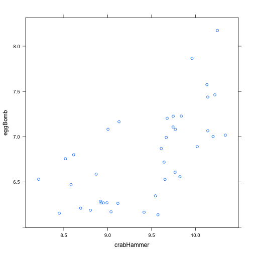 


> You try: request a scatterplot of the variable poisonFang against crabHammer.

OK:


```r
xyplot(poisonFang ~ crabHammer, kDat)
```

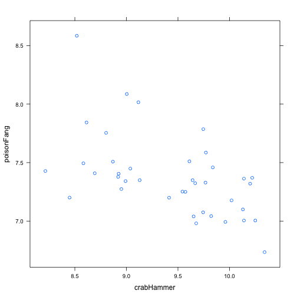 


> Let's imagine that crabHammer is somehow a natural explanatory variable or predictor (weird here, I admit, but go with me) and eggBomb and poisonFang are natural response variables. We might want to see both responses plotted against crabHammer at the same time. Here is a first way to do so, using a bit of a cheat known as the "extended formula interface" in lattice.


```r
xyplot(eggBomb + poisonFang ~ crabHammer, kDat, auto.key = TRUE)
```

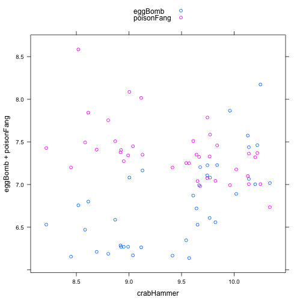 


> What if we want each response to have it's own scatterplot, but we want to put them side-by-side for comparison?


```r
xyplot(eggBomb + poisonFang ~ crabHammer, kDat, outer = TRUE, grid = TRUE)
```

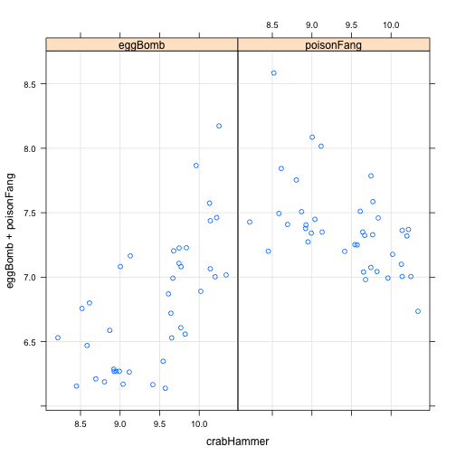 


> What if we'd like to know which points are from the wild type mice versus the Nrl knockouts?


```r
xyplot(eggBomb + poisonFang ~ crabHammer, kDat, outer = TRUE, grid = TRUE, groups = gType, 
    auto.key = TRUE)
```

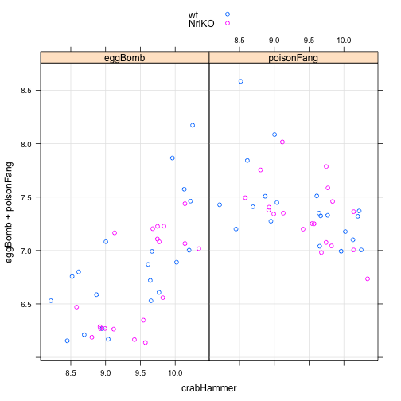 


Reshape the data into a better format:


```r
nDat <- with(kDat, data.frame(sidChar, sidNum, devStage, gType, crabHammer, 
    probeset = factor(rep(c("eggBomb", "poisonFang"), each = nrow(kDat))), geneExp = c(eggBomb, 
        poisonFang)))
str(nDat)
```

```
## 'data.frame':	78 obs. of  7 variables:
##  $ sidChar   : Factor w/ 39 levels "Sample_1","Sample_10",..: 13 14 15 16 8 9 36 17 18 19 ...
##  $ sidNum    : num  20 21 22 23 16 17 6 24 25 26 ...
##  $ devStage  : Factor w/ 5 levels "E16","P2","P6",..: 1 1 1 1 1 1 1 2 2 2 ...
##  $ gType     : Factor w/ 2 levels "wt","NrlKO": 1 1 1 1 2 2 2 1 1 1 ...
##  $ crabHammer: num  10.22 10.02 9.64 9.65 8.58 ...
##  $ probeset  : Factor w/ 2 levels "eggBomb","poisonFang": 1 1 1 1 1 1 1 1 1 1 ...
##  $ geneExp   : num  7.46 6.89 6.72 6.53 6.47 ...
```


> Now we can make the previous plot with more canonical lattice syntax, i.e. this workflow and way of thinking will serve you better in the future:

(*Note - above, we've put eggBomb and poisonFang into a new varaible, geneExp*)


```r
xyplot(geneExp ~ crabHammer | probeset, nDat, grid = TRUE, groups = gType, auto.key = TRUE)
```

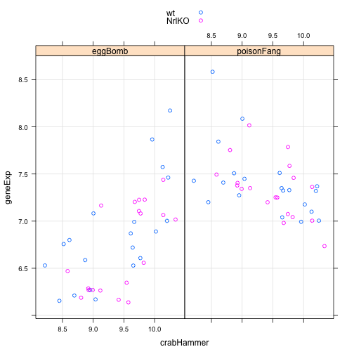 


> You try: Remake this plot but instead of conveying genotype via color, show developmental stage.

OK:


```r
xyplot(geneExp ~ crabHammer | probeset, nDat, grid = TRUE, groups = devStage, 
    auto.key = TRUE)
```

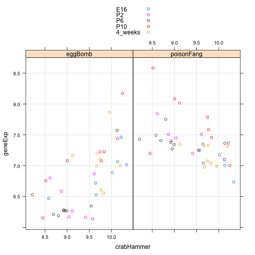 


Stripplot
---------

> The next set of figures we will make requires yet more data reshaping, which is a substantial background task in many analyses. We drop the idea of crabHammer being a predictor and eggBomb and poisonFang being responses and we just treat them all equivalently.


```r
oDat <- with(kDat, data.frame(sidChar, sidNum, devStage, gType, probeset = factor(rep(c("crabHammer", 
    "eggBomb", "poisonFang"), each = nrow(kDat))), geneExp = c(crabHammer, eggBomb, 
    poisonFang)))
str(oDat)
```

```
## 'data.frame':	117 obs. of  6 variables:
##  $ sidChar : Factor w/ 39 levels "Sample_1","Sample_10",..: 13 14 15 16 8 9 36 17 18 19 ...
##  $ sidNum  : num  20 21 22 23 16 17 6 24 25 26 ...
##  $ devStage: Factor w/ 5 levels "E16","P2","P6",..: 1 1 1 1 1 1 1 2 2 2 ...
##  $ gType   : Factor w/ 2 levels "wt","NrlKO": 1 1 1 1 2 2 2 1 1 1 ...
##  $ probeset: Factor w/ 3 levels "crabHammer","eggBomb",..: 1 1 1 1 1 1 1 1 1 1 ...
##  $ geneExp : num  10.22 10.02 9.64 9.65 8.58 ...
```


> A stripplot is a univariate scatterplot. Let's inspect the gene expression data, plain and simple.


```r
stripplot(~geneExp, oDat)
```

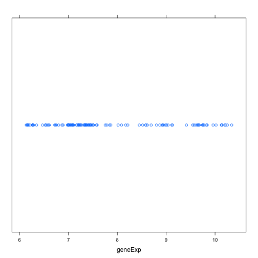 


> Pretty boring and slightly nonsensical! We had to start somewhere. Let's split things out for the three different genes.


```r
stripplot(probeset ~ geneExp, oDat)
```

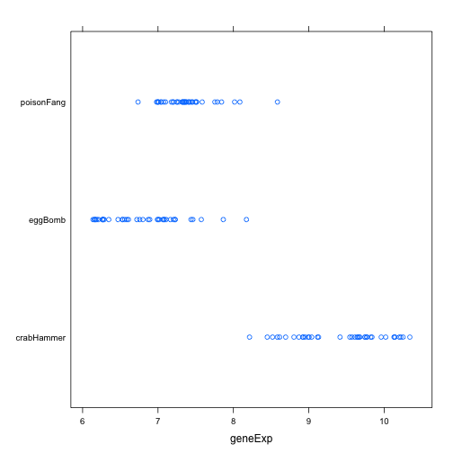 


> Sometimes, it can help to add jitter, a small bit of meaningless noise, in the horizontal position.


```r
stripplot(probeset ~ geneExp, oDat, jitter.data = TRUE)
```

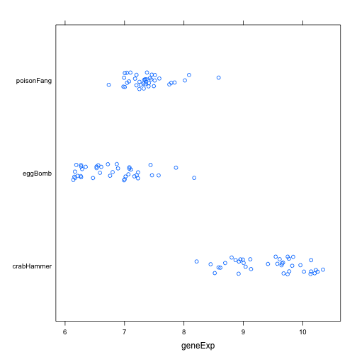 


> Notice that all the data is presented in one panel but with the different genes corresponding to different locations in the y direction. What if we want to put the different genes in different panels?


```r
stripplot(~geneExp | probeset, oDat, layout = c(nlevels(oDat$probeset), 1))
```

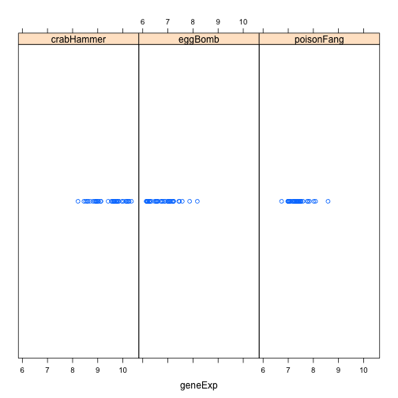 


> What if we want to see information about wild type versus Nrl knockout?


```r
stripplot(~geneExp | probeset, oDat, layout = c(nlevels(oDat$probeset), 1), 
    groups = gType, auto.key = TRUE)
```

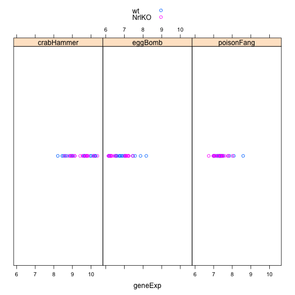 


> Let's start exploring gene expression changes over the course of development.


```r
stripplot(geneExp ~ devStage, oDat)
```

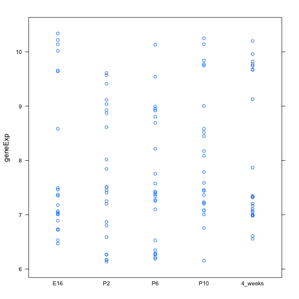 


> Retaining one panel per gene ....


```r
stripplot(geneExp ~ devStage | probeset, oDat, layout = c(nlevels(oDat$probeset), 
    1))
```

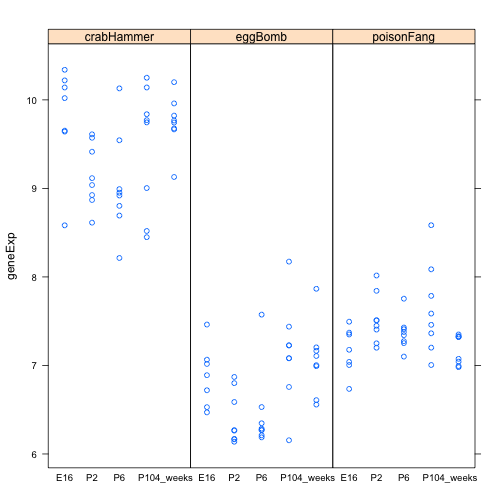 


> Adding back the genotype information ....


```r
stripplot(geneExp ~ devStage | probeset, oDat, layout = c(nlevels(oDat$probeset), 
    1), groups = gType, auto.key = TRUE)
```

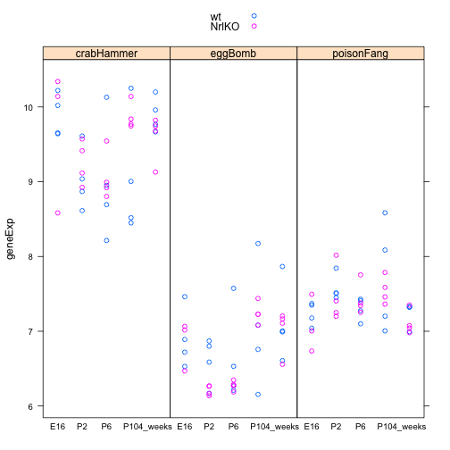 


> Adding averages


```r
stripplot(geneExp ~ devStage | probeset, oDat, layout = c(nlevels(oDat$probeset), 
    1), groups = gType, auto.key = TRUE, grid = TRUE, type = c("p", "a"))
```

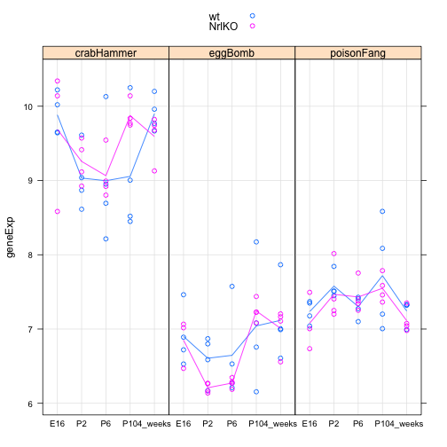 


> The argument 'type' can be used to add a variety of enhancements. Type is specified as a vector (through the use of 'c'). The option 'p' in the above example specifies the data as points on the plot, 'a' refers to getting the average of each category and joining them by a line (other summaries can be requested too). Some of the other options include 'l' for joining points by lines, 'b' for both points and lines, 'r' for adding the fit from a simple linear regression and 'smooth' for adding a nonparametric "smooth" fitted curve.

Densityplot
-----------

> Here's a nice alternative to histograms!


```r
densityplot(~geneExp, oDat)
```

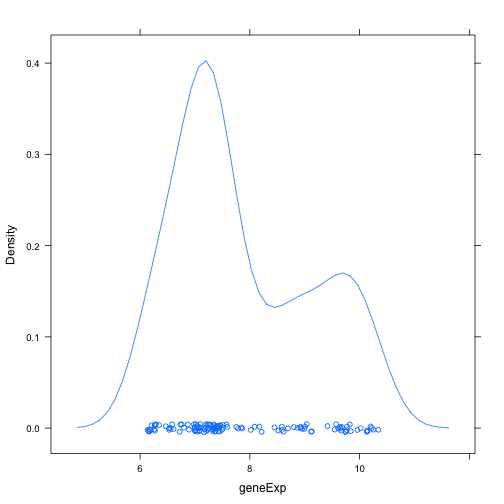 


(*Note - the stripplot of points seems to be part of the default here*)

> The vertical bar works as usual.


```r
densityplot(~geneExp | gType, oDat, grid = TRUE)
```

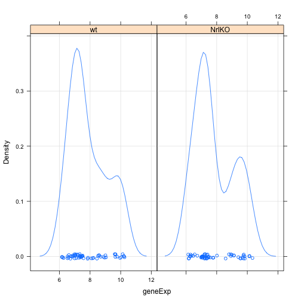 


> `groups` works as usual -- a real advantage over histogram.


```r
densityplot(~geneExp, oDat, groups = gType, auto.key = TRUE)
```

 


> The argument 'bw' specifies the bandwidth or the spread of the underlying Gaussian distributions. It controls how smooth this smoothed histogram will be. Though densityplot() has a sensible default, you can always specify directly if you wish. The argument 'n' controls the number of points at which the kernel density estimate is evaluated. It is easy to confuse this with the usual use of 'n' to denote sample size, so beware. If your density looks jaggedy, try increasing 'n'.


```r
jBw <- 0.2
jn <- 400
densityplot(~geneExp, oDat, groups = gType, auto.key = TRUE, bw = jBw, n = jn, 
    main = paste("bw =", jBw, ", n =", jn))
```

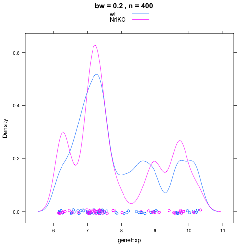 


> You try: use densityplot() to explore the gene expression distribution by gene and/or developmental stage. Play with 'bw' and 'n' if you like.

Try colouring by gene:


```r
densityplot(~geneExp, oDat, groups = probeset, auto.key = TRUE)
```

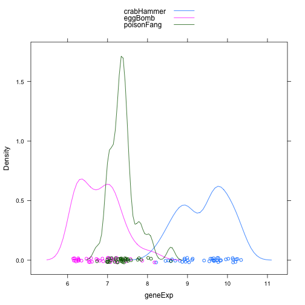 


And then by developmental stage:


```r
densityplot(~geneExp, oDat, groups = devStage, auto.key = TRUE)
```

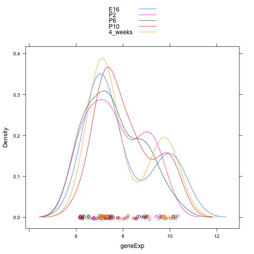 


Try splitting into panels (colour is devStage, panels are split by probe):


```r
densityplot(~geneExp | probeset, oDat, groups = devStage, auto.key = TRUE)
```

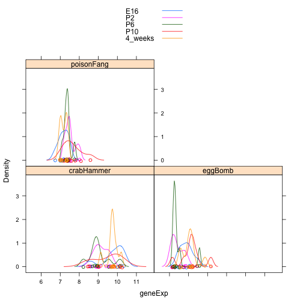 


Boxplot
-------

> There is also a time and place for boxplots, obtained with the lattice function bwplot() for "box-and-whiskers plot".

```r
bwplot(geneExp ~ devStage, oDat)
```

 


> The vertical bar | still works ....


```r
bwplot(geneExp ~ devStage | gType, oDat)
```

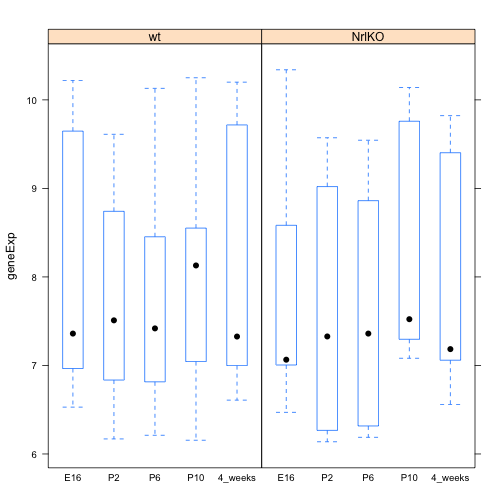 


> A violinplot is a hybrid of densityplot and histogram.


```r
bwplot(geneExp ~ devStage, oDat, panel = panel.violin)
```

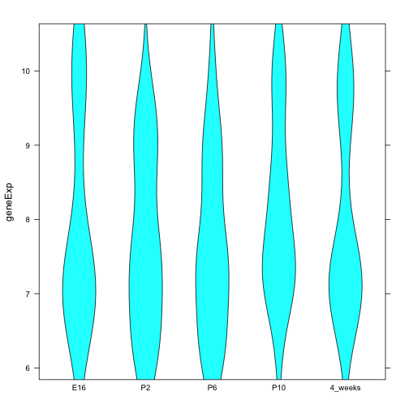 


Heatmaps
--------

Load in the larger dataset:


```r
prDat <- read.table("../../../stat540_2014/examples/photoRec/data/GSE4051_data.tsv")
str(prDat, max.level = 0)
```

```
## 'data.frame':	29949 obs. of  39 variables:
```


Load in the RDS file instead to get the factor levels:


```r
prDes <- readRDS("../../../stat540_2014/examples/photoRec/data/GSE4051_design.rds")
str(prDes)
```

```
## 'data.frame':	39 obs. of  4 variables:
##  $ sidChar : chr  "Sample_20" "Sample_21" "Sample_22" "Sample_23" ...
##  $ sidNum  : num  20 21 22 23 16 17 6 24 25 26 ...
##  $ devStage: Factor w/ 5 levels "E16","P2","P6",..: 1 1 1 1 1 1 1 2 2 2 ...
##  $ gType   : Factor w/ 2 levels "wt","NrlKO": 1 1 1 1 2 2 2 1 1 1 ...
```


> Let's draw 50 probesets at random -- but in a repeatable way!


```r
set.seed(1)
(yo <- sample(1:nrow(prDat), size = 50))
```

```
##  [1]  7952 11145 17156 27198  6040 26902 28287 19786 18837  1850  6167
## [12]  5286 20568 11499 23046 14899 21481 29690 11375 23269 27975  6350
## [23] 19503  3758  7997 11555   401 11442 26023 10184 14424 17938 14766
## [34]  5571 24751 19997 23759  3229 21647 12302 24554 19353 23416 16540
## [45] 15842 23605   698 14271 21897 20713
```

```r
hDat <- prDat[yo, ]
str(hDat)
```

```
## 'data.frame':	50 obs. of  39 variables:
##  $ Sample_20: num  8.3 8.25 6.91 6.79 6.4 ...
##  $ Sample_21: num  8.33 9.14 6.55 6.23 6.69 ...
##  $ Sample_22: num  8.43 8.19 6.59 6.69 6.14 ...
##  $ Sample_23: num  8.49 8.66 6.58 6.34 6.34 ...
##  $ Sample_16: num  8.51 6.66 7.75 7.25 5.5 ...
##  $ Sample_17: num  8.18 7.95 6.85 6.38 7.51 ...
##  $ Sample_6 : num  7.96 8.45 7.42 6.19 7.64 ...
##  $ Sample_24: num  8.34 7.49 7.17 6.84 5.83 ...
##  $ Sample_25: num  8.14 7.39 7.12 7.02 5.85 ...
##  $ Sample_26: num  8.45 6.94 7.46 7.43 6.32 ...
##  $ Sample_27: num  8.25 6.5 7.23 6.91 5.8 ...
##  $ Sample_14: num  8.46 6.99 7.14 6.78 6.29 ...
##  $ Sample_3 : num  8.53 7.14 7.23 6.88 6.15 ...
##  $ Sample_5 : num  8.45 6.71 7.36 6.92 6 ...
##  $ Sample_8 : num  8.62 6.66 7.9 6.97 5.95 ...
##  $ Sample_28: num  8.63 6.46 7.45 7.17 6.03 ...
##  $ Sample_29: num  8.58 7.84 6.72 6.91 6.31 ...
##  $ Sample_30: num  8.28 7.01 6.81 6.75 5.81 ...
##  $ Sample_31: num  8.47 6.88 7.18 6.89 5.79 ...
##  $ Sample_1 : num  8.66 6.81 7.22 6.56 6.03 ...
##  $ Sample_10: num  8.68 7.41 6.97 6.5 5.99 ...
##  $ Sample_4 : num  8.74 7.23 6.91 6.78 5.82 ...
##  $ Sample_7 : num  8.69 6.61 7.43 7.1 5.64 ...
##  $ Sample_32: num  9.7 7.62 6.96 6.89 6.82 ...
##  $ Sample_33: num  8.72 6.83 7.36 7.21 5.93 ...
##  $ Sample_34: num  8.58 6.73 7.63 7.19 5.93 ...
##  $ Sample_35: num  8.54 6.91 7.14 6.71 5.59 ...
##  $ Sample_13: num  8.73 6.83 7.14 6.46 6.25 ...
##  $ Sample_15: num  8.57 6.86 7.12 6.72 5.84 ...
##  $ Sample_18: num  8.96 6.95 6.96 6.31 6.44 ...
##  $ Sample_19: num  8.65 6.69 7.03 6.91 6.32 ...
##  $ Sample_36: num  10.41 7.9 6.57 6.87 6.09 ...
##  $ Sample_37: num  9.48 6.36 6.99 6.85 6.08 ...
##  $ Sample_38: num  10.14 7.24 6.95 6.99 6.13 ...
##  $ Sample_39: num  9.48 6.21 6.97 7.13 6.02 ...
##  $ Sample_11: num  9.09 6.23 7 6.4 6.22 ...
##  $ Sample_12: num  9.21 6.47 7.17 6.78 5.76 ...
##  $ Sample_2 : num  9.05 6.2 7.2 6.54 5.9 ...
##  $ Sample_9 : num  8.89 7.67 6.86 6.72 6.26 ...
```


> The functions for heatmapping expect a matrix not a data.frame, so we will convert hDat and also transpose for a nicer heatmap orientation below. I also give the samples more informative names that capture genotype and developmental stage.


```r
hDat <- as.matrix(t(hDat))
rownames(hDat) <- with(prDes, paste(devStage, gType, sidChar, sep = "_"))
str(hDat)
```

```
##  num [1:39, 1:50] 8.3 8.33 8.43 8.49 8.51 ...
##  - attr(*, "dimnames")=List of 2
##   ..$ : chr [1:39] "E16_wt_Sample_20" "E16_wt_Sample_21" "E16_wt_Sample_22" "E16_wt_Sample_23" ...
##   ..$ : chr [1:50] "1426822_at" "1431375_s_at" "1440076_at" "1456157_at" ...
```


Plot a heatmap:


```r
heatmap(hDat, Rowv = NA, Colv = NA, scale = "none", margins = c(5, 8))
```

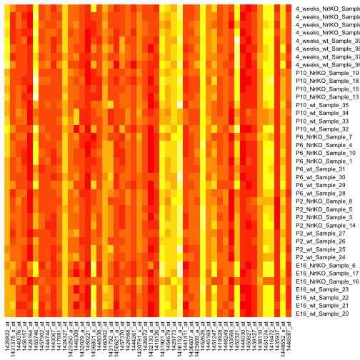 


> Some of the other built-in color schemes aren't quite as likely to make your eyes bleed ...


```r
heatmap(hDat, Rowv = NA, Colv = NA, col = cm.colors(256), scale = "none", margins = c(5, 
    8))
```

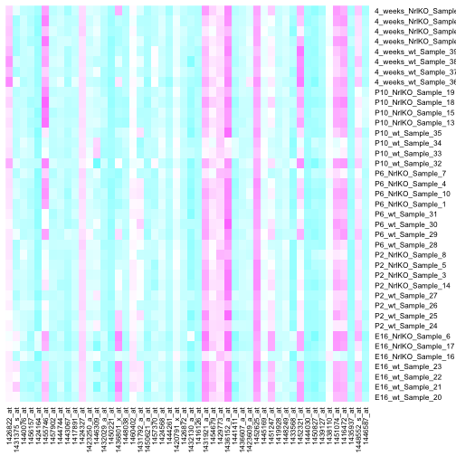 


(_Note: the col argument is the one that changed the colours_)

Load RColorBrewer to get access to more palettes:


```r
library(RColorBrewer)
display.brewer.all()
```

 


Use colorRampPalette to make custom palettes:


```r
jGraysFun <- colorRampPalette(brewer.pal(n = 9, "Greys"))
jBuPuFun <- colorRampPalette(brewer.pal(n = 9, "BuPu"))
```


Re-plot the heatmap using the two new palettes:


```r
heatmap(hDat, Rowv = NA, Colv = NA, scale = "none", margins = c(5, 8), col = jGraysFun(256))
```

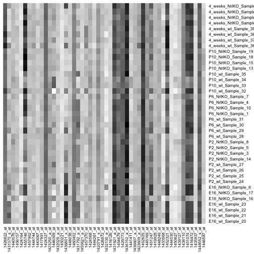 

```r
heatmap(hDat, Rowv = NA, Colv = NA, scale = "none", margins = c(5, 8), col = jBuPuFun(256))
```

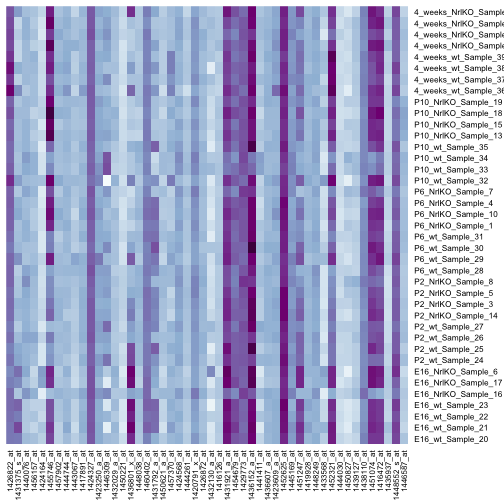 


> By specifying Rowv = NA, Colv = NA, scale = "none", we have been suppressing some rather common heatmap features -- the inclusion of row and column dendrograms and the normalization of the data. Let's look at the heatmap as it would be rendered by default.


```r
heatmap(hDat, margins = c(5, 8), col = jBuPuFun(256))
```

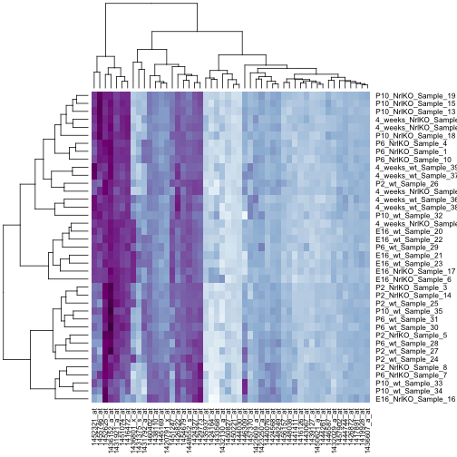 


> Now we allow scaling within column:


```r
heatmap(hDat, col = jBuPuFun(256), margins = c(5, 8), scale = c("column"))
```

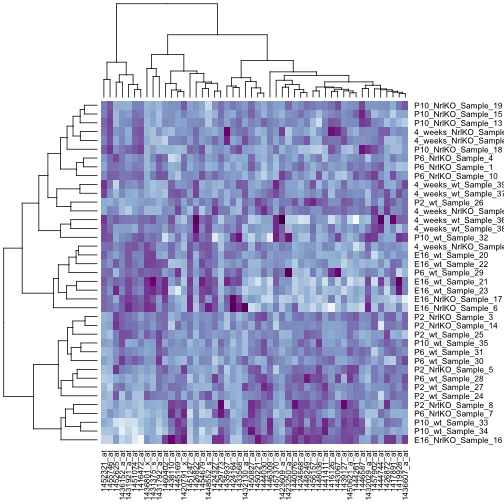 


> Finally we try out another popular heatmapping function heatmap.2() from the gplots package. This adds an automatic color legend, which helps you determine what each color extreme actually means. If you need to install the package do this:


```r
install.packages("gplots")
```

```
## Error: trying to use CRAN without setting a mirror
```

```r
library(gplots)
```

```
## KernSmooth 2.23 loaded
## Copyright M. P. Wand 1997-2009
## 
## Attaching package: 'gplots'
## 
## The following object is masked from 'package:stats':
## 
##     lowess
```

```r
heatmap.2(hDat, col = jGraysFun, trace = "none")
```

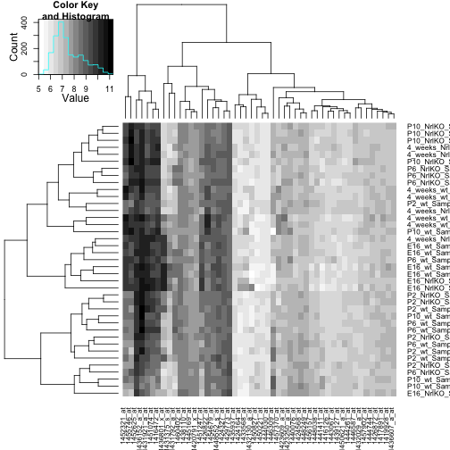 

```r
heatmap.2(hDat, col = jBuPuFun, trace = "none")
```

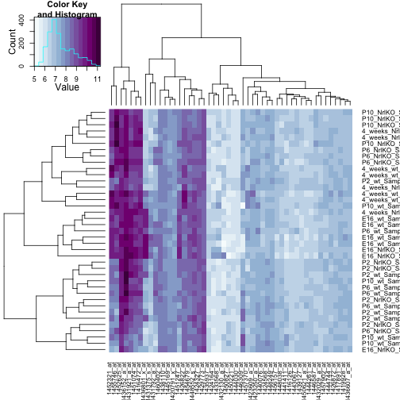 


Overplotting
------------

> Now that we've loaded the main dataset we can also explore high-volume scatterplotting and the solutions to overplotting. First let's pick two samples at random to plot against each other.


```r
set.seed(924)
(yo <- sample(1:ncol(prDat), size = 2))
```

```
## [1] 25 24
```

```r
y <- prDat[[yo[1]]]
z <- prDat[[yo[2]]]
str(y)
```

```
##  num [1:29949] 7.01 8.97 9.22 8.42 8.53 ...
```

```r
str(z)
```

```
##  num [1:29949] 7.54 9.53 9.92 8.78 8.57 ...
```


(_Note: subsetting notation to get the two vectors out of the larger object_)


```r
xyplot(y ~ z, asp = 1)
```

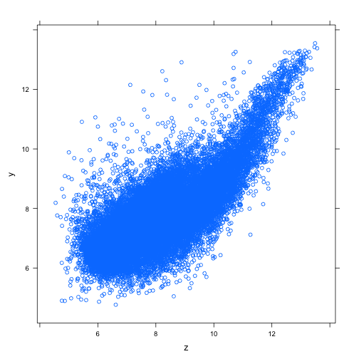 


Overplotting!


```r
smoothScatter(y ~ z, asp = 1)
```

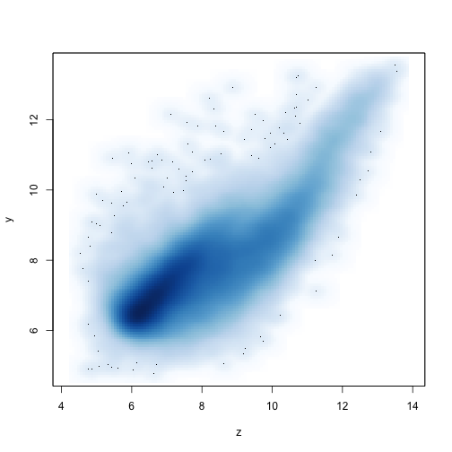 


> You can see that we were missing some information in the dark cloud above. There is one main clump of data, concentrated around (6, 6) and then petering out diagonally up the x = y line. There's arguably a second, smaller clump of data on a steeper line running through the points ~(10, 8) and ~(14, 14).

> The xyplot() function in lattice can produce a similar plot by specifying a smoothScatter-type of panel function.


```r
xyplot(y ~ z, asp = 1, panel = panel.smoothScatter, nbin = 150)
```

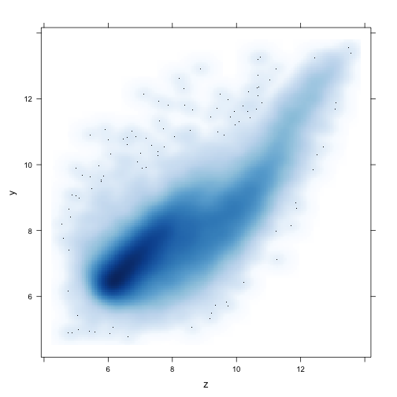 


> The add-on package hexbin implements hexagonal binning. Basically the plane is divided into hexagons and shaded as described above. Install it if you need to.


```r
install.packages("hexbin")
```

```
## Error: trying to use CRAN without setting a mirror
```

```r
library(hexbin)
```

```
## Loading required package: grid
```

```r
hexbinplot(y ~ z)
```

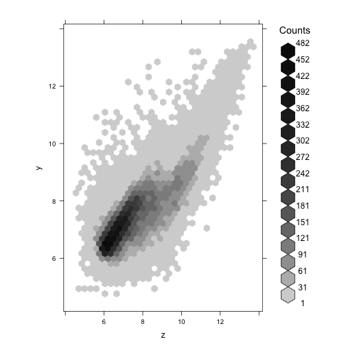 


Plot matrix
-----------

Functions for plotting pairs of samples against eachother


```r
set.seed(3)
(yo <- sample(1:ncol(prDat), size = 4))
```

```
## [1]  7 31 15 12
```

```r
pairDat <- subset(prDat, select = yo)
str(pairDat)
```

```
## 'data.frame':	29949 obs. of  4 variables:
##  $ Sample_6 : num  7.24 9.71 10.17 8.84 8.54 ...
##  $ Sample_19: num  7.21 9.21 9.59 8.31 8.31 ...
##  $ Sample_8 : num  7.11 8.24 9.13 8.13 8.33 ...
##  $ Sample_14: num  7.09 9.56 9.88 8.57 8.59 ...
```


> Using the base function pairs() ... You will notice this is a bit slow and we get the usual awful dark point clouds.


```r
pairs(pairDat)
```

 


> However, pairs() can be combined with smoothScatter() for a better result. Somewhat faster and definitely better looking, more informative.


```r
pairs(pairDat, panel = function(...) smoothScatter(..., add = TRUE))
```

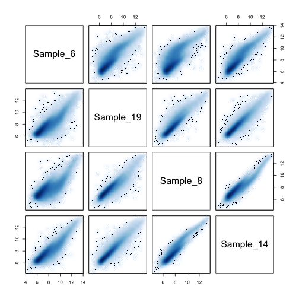 


(_Note: I'm not sure what the '...' notation means still_)

> Here's splom() from lattice, first using the default, non-high-volume panel function.


```r
splom(pairDat)
```

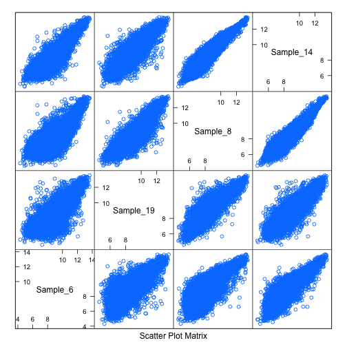 


> Here's splom() from lattice again, but using a smoothScatter-type panel function. Much faster! More informative!


```r
splom(pairDat, panel = panel.smoothScatter, raster = TRUE)
```

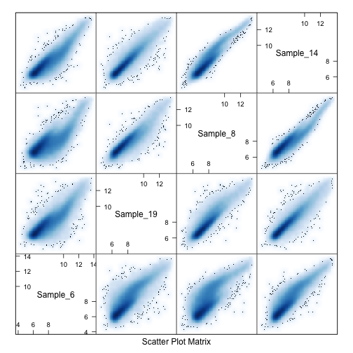 


> Finally, here's hexplom().


```r
hexplom(pairDat)
```

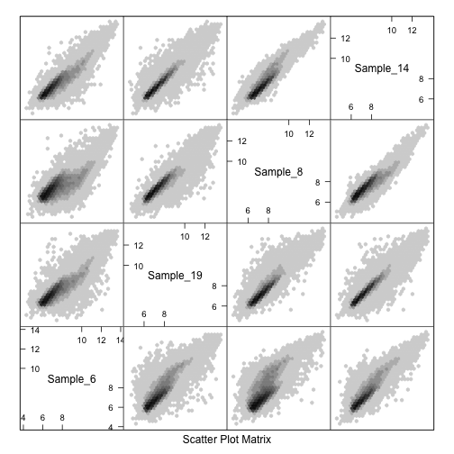 


ggplot2
=======

*Note that the dataset was loaded at the top of this document, since I'm continuing from the latice tutorial*


```r
str(kDat)
```

```
## 'data.frame':	39 obs. of  7 variables:
##  $ sidChar   : chr  "Sample_20" "Sample_21" "Sample_22" "Sample_23" ...
##  $ sidNum    : num  20 21 22 23 16 17 6 24 25 26 ...
##  $ devStage  : Factor w/ 5 levels "E16","P2","P6",..: 1 1 1 1 1 1 1 2 2 2 ...
##  $ gType     : Factor w/ 2 levels "wt","NrlKO": 1 1 1 1 2 2 2 1 1 1 ...
##  $ crabHammer: num  10.22 10.02 9.64 9.65 8.58 ...
##  $ eggBomb   : num  7.46 6.89 6.72 6.53 6.47 ...
##  $ poisonFang: num  7.37 7.18 7.35 7.04 7.49 ...
```

```r
table(kDat$devStage)
```

```
## 
##     E16      P2      P6     P10 4_weeks 
##       7       8       8       8       8
```

```r
table(kDat$gType)
```

```
## 
##    wt NrlKO 
##    20    19
```

```r
with(kDat, table(devStage, gType))
```

```
##          gType
## devStage  wt NrlKO
##   E16      4     3
##   P2       4     4
##   P6       4     4
##   P10      4     4
##   4_weeks  4     4
```


qplot
-----

Simple scatter plot:


```r
qplot(crabHammer, eggBomb, data = kDat)
```

 


scatterplots
------------

Now use the main ggplot function instead of qplot:


```r
p <- ggplot(kDat, aes(x = crabHammer, y = eggBomb))
str(p)
```

```
## List of 9
##  $ data       :'data.frame':	39 obs. of  7 variables:
##   ..$ sidChar   : chr [1:39] "Sample_20" "Sample_21" "Sample_22" "Sample_23" ...
##   ..$ sidNum    : num [1:39] 20 21 22 23 16 17 6 24 25 26 ...
##   ..$ devStage  : Factor w/ 5 levels "E16","P2","P6",..: 1 1 1 1 1 1 1 2 2 2 ...
##   ..$ gType     : Factor w/ 2 levels "wt","NrlKO": 1 1 1 1 2 2 2 1 1 1 ...
##   ..$ crabHammer: num [1:39] 10.22 10.02 9.64 9.65 8.58 ...
##   ..$ eggBomb   : num [1:39] 7.46 6.89 6.72 6.53 6.47 ...
##   ..$ poisonFang: num [1:39] 7.37 7.18 7.35 7.04 7.49 ...
##  $ layers     : list()
##  $ scales     :Reference class 'Scales' [package "ggplot2"] with 1 fields
##   ..$ scales: NULL
##   ..and 21 methods, of which 9 are possibly relevant:
##   ..  add, clone, find, get_scales, has_scale, initialize, input, n,
##   ..  non_position_scales
##  $ mapping    :List of 2
##   ..$ x: symbol crabHammer
##   ..$ y: symbol eggBomb
##  $ theme      : list()
##  $ coordinates:List of 1
##   ..$ limits:List of 2
##   .. ..$ x: NULL
##   .. ..$ y: NULL
##   ..- attr(*, "class")= chr [1:2] "cartesian" "coord"
##  $ facet      :List of 1
##   ..$ shrink: logi TRUE
##   ..- attr(*, "class")= chr [1:2] "null" "facet"
##  $ plot_env   :<environment: R_GlobalEnv> 
##  $ labels     :List of 2
##   ..$ x: chr "crabHammer"
##   ..$ y: chr "eggBomb"
##  - attr(*, "class")= chr [1:2] "gg" "ggplot"
```

```r
print(p)  # Error: No layers in plot
```

```
## Error: No layers in plot
```


This just sets the aesthetics. To actually plot something, we need to add a layer:


```r
(p <- p + geom_point())
```

 

```r
(p <- p + stat_smooth())
```

```
## geom_smooth: method="auto" and size of largest group is <1000, so using loess. Use 'method = x' to change the smoothing method.
```

 


Some customization options:


```r
(p <- p + theme_bw() + xlab("Expression of crabHammer") + ylab("Expression of eggBomb") + 
    ggtitle("Scatterplot for expression levels"))
```

```
## geom_smooth: method="auto" and size of largest group is <1000, so using loess. Use 'method = x' to change the smoothing method.
```

 


Re-shape data to mimic the earlier lattice plot:


```r
nDat <- with(kDat, data.frame(sidChar, sidNum, devStage, gType, crabHammer, 
    probeset = factor(rep(c("eggBomb", "poisonFang"), each = nrow(kDat))), geneExp = c(eggBomb, 
        poisonFang)))
str(nDat)
```

```
## 'data.frame':	78 obs. of  7 variables:
##  $ sidChar   : Factor w/ 39 levels "Sample_1","Sample_10",..: 13 14 15 16 8 9 36 17 18 19 ...
##  $ sidNum    : num  20 21 22 23 16 17 6 24 25 26 ...
##  $ devStage  : Factor w/ 5 levels "E16","P2","P6",..: 1 1 1 1 1 1 1 2 2 2 ...
##  $ gType     : Factor w/ 2 levels "wt","NrlKO": 1 1 1 1 2 2 2 1 1 1 ...
##  $ crabHammer: num  10.22 10.02 9.64 9.65 8.58 ...
##  $ probeset  : Factor w/ 2 levels "eggBomb","poisonFang": 1 1 1 1 1 1 1 1 1 1 ...
##  $ geneExp   : num  7.46 6.89 6.72 6.53 6.47 ...
```


Wrong way to map colour:


```r
(p <- ggplot(nDat, aes(crabHammer, geneExp)) + geom_point(color = probeset))
```

```
## Error: object 'probeset' not found
```


The above doesn't work because it didn't _map_ the data - it tried to apply probeset to _all_ the data. Correct way to call is:


```r
(p <- ggplot(nDat, aes(crabHammer, geneExp, colour = probeset)) + geom_point())
```

 


Add smoothers again:


```r
(p <- ggplot(nDat, aes(crabHammer, geneExp, color = probeset)) + geom_point() + 
    stat_smooth(se = FALSE))
```

```
## geom_smooth: method="auto" and size of largest group is <1000, so using loess. Use 'method = x' to change the smoothing method.
```

 


*Note that in the original, the call was* `se = F` *- that seems a little opaque to me*

The smoother was applied to each group, after we created groups using the colour aesthetic. To over-rule that:


```r
(p <- ggplot(nDat, aes(crabHammer, geneExp, color = probeset)) + geom_point() + 
    stat_smooth(se = F, aes(group = 1)))
```

```
## geom_smooth: method="auto" and size of largest group is <1000, so using loess. Use 'method = x' to change the smoothing method.
```

 


Use facets to split things into panels:


```r
(p <- ggplot(nDat, aes(crabHammer, geneExp)) + geom_point() + facet_wrap(~probeset))
```

 


Add colours to indicate genotype:


```r
(p <- ggplot(nDat, aes(crabHammer, geneExp, color = gType)) + geom_point() + 
    facet_wrap(~probeset))
```

 


*You try: Remake this plot but instead of conveying genotype via color, show developmental stage.*

OK:


```r
(p <- ggplot(nDat, aes(crabHammer, geneExp, color = devStage)) + geom_point() + 
    facet_wrap(~probeset))
```

 


Stripplot
---------

Reshape the data again:


```r
oDat <- with(kDat, data.frame(sidChar, sidNum, devStage, gType, probeset = factor(rep(c("crabHammer", 
    "eggBomb", "poisonFang"), each = nrow(kDat))), geneExp = c(crabHammer, eggBomb, 
    poisonFang)))
str(oDat)
```

```
## 'data.frame':	117 obs. of  6 variables:
##  $ sidChar : Factor w/ 39 levels "Sample_1","Sample_10",..: 13 14 15 16 8 9 36 17 18 19 ...
##  $ sidNum  : num  20 21 22 23 16 17 6 24 25 26 ...
##  $ devStage: Factor w/ 5 levels "E16","P2","P6",..: 1 1 1 1 1 1 1 2 2 2 ...
##  $ gType   : Factor w/ 2 levels "wt","NrlKO": 1 1 1 1 2 2 2 1 1 1 ...
##  $ probeset: Factor w/ 3 levels "crabHammer","eggBomb",..: 1 1 1 1 1 1 1 1 1 1 ...
##  $ geneExp : num  10.22 10.02 9.64 9.65 8.58 ...
```


Simple stripplot:


```r
(p <- ggplot(oDat, aes(geneExp, probeset)) + geom_point())
```

 


Add jitter:


```r
(p <- ggplot(oDat, aes(geneExp, probeset)) + geom_point(position = position_jitter(height = 0.1)))
```

 


Look at changes relative to developmental stage:


```r
(p <- ggplot(oDat, aes(devStage, geneExp)) + geom_point())
```

 


Split into panels:


```r
(p <- p + facet_wrap(~probeset))
```

 

```r
(p <- p + aes(color = gType))
```

 


Add averages using a summary stat:


```r
(p <- p + stat_summary(fun.y = mean, geom = "point", shape = 4, size = 4))
```

 


Density plots
-------------

Simple density plot two ways:


```r
(p <- ggplot(oDat, aes(geneExp)) + geom_density())
```

 

```r
(p <- ggplot(oDat, aes(geneExp)) + stat_density(geom = "line", position = "identity"))
```

 


To mimic the lattice graphic:


```r
(p <- ggplot(oDat, aes(geneExp)) + stat_density(geom = "line", position = "identity") + 
    geom_point(aes(y = 0.05), position = position_jitter(height = 0.005)))
```

 


Change the bandwidth of the density plot using `adjust`:


```r
(p <- ggplot(oDat, aes(geneExp)) + stat_density(geom = "line", position = "identity", 
    adjust = 0.5) + geom_point(aes(y = 0.05), position = position_jitter(height = 0.005)))
```

 


Add facets:


```r
(p <- p + facet_wrap(~gType))
```

 


Or colours:


```r
(p <- ggplot(oDat, aes(geneExp, color = gType)) + stat_density(geom = "line", 
    position = "identity") + geom_point(aes(y = 0.05), position = position_jitter(height = 0.005)))
```

 


Take-home Problem
=================

> The full photoRec dataset has 39 samples and 29949 probesets. Choose 2 ... or 20 ... or 200 random probesets/genes and look for gene expression differences between the two genotypes, wild type versus knockout. Make use of the graphing techniques discussed this week such as scatter plots, data heatmaps, correlation heatmaps, etc. Share questions, success, failure on the Google group.


