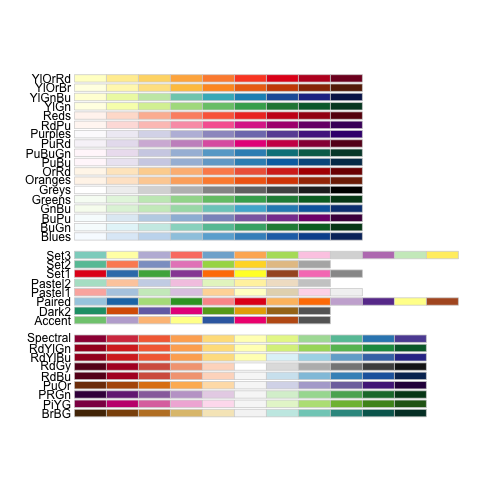

STAT540 Seminar 03 - lattice and ggplot2 graphics
=================================================

Rod Docking - 2014-01-23

This is a workthrough of the material for the [lattice](http://www.ugrad.stat.ubc.ca/~stat540/seminars/seminar03_graphics-lattice.html) and [ggplot2](http://www.ugrad.stat.ubc.ca/~stat540/seminars/seminar03_graphics-ggplot2.html)
tutorials for STAT540.

Load the necessary libraries:


```r
library(lattice)
library(ggplot2)
```


Read in the input data set. 
(*Note that this is reading from a symlink to to the original data file from the course repo*)


```r
kDat <- readRDS("GSE4051_MINI.rds")
```

```
## Warning: cannot open compressed file 'GSE4051_MINI.rds', probable reason
## 'No such file or directory'
```

```
## Error: cannot open the connection
```

```r
str(kDat)
```

```
## Error: object 'kDat' not found
```

```r
table(kDat$devStage)
```

```
## Error: object 'kDat' not found
```

```r
table(kDat$gType)
```

```
## Error: object 'kDat' not found
```

```r
with(kDat, table(devStage, gType))
```

```
## Error: object 'kDat' not found
```


Scatterplots
------------

Make a scatterplot of the expression of two separate genes:


```r
xyplot(eggBomb ~ crabHammer, kDat)
```

```
## Error: object 'kDat' not found
```


> You try: request a scatterplot of the variable poisonFang against crabHammer.

OK:


```r
xyplot(poisonFang ~ crabHammer, kDat)
```

```
## Error: object 'kDat' not found
```


> Let's imagine that crabHammer is somehow a natural explanatory variable or predictor (weird here, I admit, but go with me) and eggBomb and poisonFang are natural response variables. We might want to see both responses plotted against crabHammer at the same time. Here is a first way to do so, using a bit of a cheat known as the "extended formula interface" in lattice.


```r
xyplot(eggBomb + poisonFang ~ crabHammer, kDat, auto.key = TRUE)
```

```
## Error: object 'kDat' not found
```


> What if we want each response to have it's own scatterplot, but we want to put them side-by-side for comparison?


```r
xyplot(eggBomb + poisonFang ~ crabHammer, kDat, outer = TRUE, grid = TRUE)
```

```
## Error: object 'kDat' not found
```


> What if we'd like to know which points are from the wild type mice versus the Nrl knockouts?


```r
xyplot(eggBomb + poisonFang ~ crabHammer, kDat, outer = TRUE, grid = TRUE, groups = gType, 
    auto.key = TRUE)
```

```
## Error: object 'kDat' not found
```


Reshape the data into a better format:


```r
nDat <- with(kDat, data.frame(sidChar, sidNum, devStage, gType, crabHammer, 
    probeset = factor(rep(c("eggBomb", "poisonFang"), each = nrow(kDat))), geneExp = c(eggBomb, 
        poisonFang)))
```

```
## Error: object 'kDat' not found
```

```r
str(nDat)
```

```
## Error: object 'nDat' not found
```


> Now we can make the previous plot with more canonical lattice syntax, i.e. this workflow and way of thinking will serve you better in the future:

(*Note - above, we've put eggBomb and poisonFang into a new varaible, geneExpe*)


```r
xyplot(geneExp ~ crabHammer | probeset, nDat, grid = TRUE, groups = gType, auto.key = TRUE)
```

```
## Error: object 'nDat' not found
```


> You try: Remake this plot but instead of conveying genotype via color, show developmental stage.

OK:


```r
xyplot(geneExp ~ crabHammer | probeset, nDat, grid = TRUE, groups = devStage, 
    auto.key = TRUE)
```

```
## Error: object 'nDat' not found
```


Stripplot
---------

> The next set of figures we will make requires yet more data reshaping, which is a substantial background task in many analyses. We drop the idea of crabHammer being a predictor and eggBomb and poisonFang being responses and we just treat them all equivalently.


```r
oDat <- with(kDat, data.frame(sidChar, sidNum, devStage, gType, probeset = factor(rep(c("crabHammer", 
    "eggBomb", "poisonFang"), each = nrow(kDat))), geneExp = c(crabHammer, eggBomb, 
    poisonFang)))
```

```
## Error: object 'kDat' not found
```

```r
str(oDat)
```

```
## Error: object 'oDat' not found
```


> A stripplot is a univariate scatterplot. Let's inspect the gene expression data, plain and simple.


```r
stripplot(~geneExp, oDat)
```

```
## Error: object 'oDat' not found
```


> Pretty boring and slightly nonsensical! We had to start somewhere. Let's split things out for the three different genes.


```r
stripplot(probeset ~ geneExp, oDat)
```

```
## Error: object 'oDat' not found
```


> Sometimes, it can help to add jitter, a small bit of meaningless noise, in the horizontal position.


```r
stripplot(probeset ~ geneExp, oDat, jitter.data = TRUE)
```

```
## Error: object 'oDat' not found
```


> Notice that all the data is presented in one panel but with the different genes corresponding to different locations in the y direction. What if we want to put the different genes in different panels?


```r
stripplot(~geneExp | probeset, oDat, layout = c(nlevels(oDat$probeset), 1))
```

```
## Error: object 'oDat' not found
```


> What if we want to see information about wild type versus Nrl knockout?


```r
stripplot(~geneExp | probeset, oDat, layout = c(nlevels(oDat$probeset), 1), 
    groups = gType, auto.key = TRUE)
```

```
## Error: object 'oDat' not found
```


> Let's start exploring gene expression changes over the course of development.


```r
stripplot(geneExp ~ devStage, oDat)
```

```
## Error: object 'oDat' not found
```


> Retaining one panel per gene ....


```r
stripplot(geneExp ~ devStage | probeset, oDat, layout = c(nlevels(oDat$probeset), 
    1))
```

```
## Error: object 'oDat' not found
```


> Adding back the genotype information ....


```r
stripplot(geneExp ~ devStage | probeset, oDat, layout = c(nlevels(oDat$probeset), 
    1), groups = gType, auto.key = TRUE)
```

```
## Error: object 'oDat' not found
```


> Adding averages


```r
stripplot(geneExp ~ devStage | probeset, oDat, layout = c(nlevels(oDat$probeset), 
    1), groups = gType, auto.key = TRUE, grid = TRUE, type = c("p", "a"))
```

```
## Error: object 'oDat' not found
```


> The argument 'type' can be used to add a variety of enhancements. Type is specified as a vector (through the use of 'c'). The option 'p' in the above example specifies the data as points on the plot, 'a' refers to getting the average of each category and joining them by a line (other summaries can be requested too). Some of the other options include 'l' for joining points by lines, 'b' for both points and lines, 'r' for adding the fit from a simple linear regression and 'smooth' for adding a nonparametric "smooth" fitted curve.

Densityplot
-----------

> Here's a nice alternative to histograms!


```r
densityplot(~geneExp, oDat)
```

```
## Error: object 'oDat' not found
```


(*Note - the stripplot of points seems to be part of the default here*)

> The vertical bar works as usual.


```r
densityplot(~geneExp | gType, oDat, grid = TRUE)
```

```
## Error: object 'oDat' not found
```


> `groups` works as usual -- a real advantage over histogram.


```r
densityplot(~geneExp, oDat, groups = gType, auto.key = TRUE)
```

```
## Error: object 'oDat' not found
```


> The argument 'bw' specifies the bandwidth or the spread of the underlying Gaussian distributions. It controls how smooth this smoothed histogram will be. Though densityplot() has a sensible default, you can always specify directly if you wish. The argument 'n' controls the number of points at which the kernel density estimate is evaluated. It is easy to confuse this with the usual use of 'n' to denote sample size, so beware. If your density looks jaggedy, try increasing 'n'.


```r
jBw <- 0.2
jn <- 400
densityplot(~geneExp, oDat, groups = gType, auto.key = TRUE, bw = jBw, n = jn, 
    main = paste("bw =", jBw, ", n =", jn))
```

```
## Error: object 'oDat' not found
```


> You try: use densityplot() to explore the gene expression distribution by gene and/or developmental stage. Play with 'bw' and 'n' if you like.

Try colouring by gene:


```r
densityplot(~geneExp, oDat, groups = probeset, auto.key = TRUE)
```

```
## Error: object 'oDat' not found
```


And then by developmental stage:


```r
densityplot(~geneExp, oDat, groups = devStage, auto.key = TRUE)
```

```
## Error: object 'oDat' not found
```


Try splitting into panels (colour is devStage, panels are split by probe):


```r
densityplot(~geneExp | probeset, oDat, groups = devStage, auto.key = TRUE)
```

```
## Error: object 'oDat' not found
```


Boxplot
-------

> There is also a time and place for boxplots, obtained with the lattice function bwplot() for "box-and-whiskers plot".

```r
bwplot(geneExp ~ devStage, oDat)
```

```
## Error: object 'oDat' not found
```


> The vertical bar | still works ....


```r
bwplot(geneExp ~ devStage | gType, oDat)
```

```
## Error: object 'oDat' not found
```


> A violinplot is a hybrid of densityplot and histogram.


```r
bwplot(geneExp ~ devStage, oDat, panel = panel.violin)
```

```
## Error: object 'oDat' not found
```


Heatmaps
--------

Load in the larger dataset:


```r
prDat <- read.table("GSE4051_data.tsv")
```

```
## Warning: cannot open file 'GSE4051_data.tsv': No such file or directory
```

```
## Error: cannot open the connection
```

```r
str(prDat, max.level = 0)
```

```
## Error: object 'prDat' not found
```


Load in the RDS file instead to get the factor levels:


```r
prDes <- readRDS("GSE4051_design.rds")
```

```
## Warning: cannot open compressed file 'GSE4051_design.rds', probable reason
## 'No such file or directory'
```

```
## Error: cannot open the connection
```

```r
str(prDes)
```

```
## Error: object 'prDes' not found
```


> Let's draw 50 probesets at random -- but in a repeatable way!


```r
set.seed(1)
(yo <- sample(1:nrow(prDat), size = 50))
```

```
## Error: object 'prDat' not found
```

```r
hDat <- prDat[yo, ]
```

```
## Error: object 'prDat' not found
```

```r
str(hDat)
```

```
## Error: object 'hDat' not found
```


> The functions for heatmapping expect a matrix not a data.frame, so we will convert hDat and also transpose for a nicer heatmap orientation below. I also give the samples more informative names that capture genotype and developmental stage.


```r
hDat <- as.matrix(t(hDat))
```

```
## Error: object 'hDat' not found
```

```r
rownames(hDat) <- with(prDes, paste(devStage, gType, sidChar, sep = "_"))
```

```
## Error: object 'prDes' not found
```

```r
str(hDat)
```

```
## Error: object 'hDat' not found
```


Plot a heatmap:


```r
heatmap(hDat, Rowv = NA, Colv = NA, scale = "none", margins = c(5, 8))
```

```
## Error: object 'hDat' not found
```


> Some of the other built-in color schemes aren't quite as likely to make your eyes bleed ...


```r
heatmap(hDat, Rowv = NA, Colv = NA, col = cm.colors(256), scale = "none", margins = c(5, 
    8))
```

```
## Error: object 'hDat' not found
```


(_Note: the col argument is the one that changed the colours_)

Load RColorBrewer to get access to more palettes:


```r
library(RColorBrewer)
display.brewer.all()
```

 


Use colorRampPalette to make custom palettes:


```r
jGraysFun <- colorRampPalette(brewer.pal(n = 9, "Greys"))
jBuPuFun <- colorRampPalette(brewer.pal(n = 9, "BuPu"))
```


Re-plot the heatmap using the two new palettes:


```r
heatmap(hDat, Rowv = NA, Colv = NA, scale = "none", margins = c(5, 8), col = jGraysFun(256))
```

```
## Error: object 'hDat' not found
```

```r
heatmap(hDat, Rowv = NA, Colv = NA, scale = "none", margins = c(5, 8), col = jBuPuFun(256))
```

```
## Error: object 'hDat' not found
```


> By specifying Rowv = NA, Colv = NA, scale = "none", we have been suppressing some rather common heatmap features -- the inclusion of row and column dendrograms and the normalization of the data. Let's look at the heatmap as it would be rendered by default.


```r
heatmap(hDat, margins = c(5, 8), col = jBuPuFun(256))
```

```
## Error: object 'hDat' not found
```


> Now we allow scaling within column:


```r
heatmap(hDat, col = jBuPuFun(256), margins = c(5, 8), scale = c("column"))
```

```
## Error: object 'hDat' not found
```


> Finally we try out another popular heatmapping function heatmap.2() from the gplots package. This adds an automatic color legend, which helps you determine what each color extreme actually means. If you need to install the package do this:


```r
install.packages("gplots")
```

```
## Error: trying to use CRAN without setting a mirror
```

```r
library(gplots)
```

```
## Error: there is no package called 'gplots'
```

```r
heatmap.2(hDat, col = jGraysFun, trace = "none")
```

```
## Error: could not find function "heatmap.2"
```

```r
heatmap.2(hDat, col = jBuPuFun, trace = "none")
```

```
## Error: could not find function "heatmap.2"
```


Overplotting
------------

> Now that we've loaded the main dataset we can also explore high-volume scatterplotting and the solutions to overplotting. First let's pick two samples at random to plot against each other.


```r
set.seed(924)
(yo <- sample(1:ncol(prDat), size = 2))
```

```
## Error: object 'prDat' not found
```

```r
y <- prDat[[yo[1]]]
```

```
## Error: object 'prDat' not found
```

```r
z <- prDat[[yo[2]]]
```

```
## Error: object 'prDat' not found
```

```r
str(y)
```

```
## Error: object 'y' not found
```

```r
str(z)
```

```
## Error: object 'z' not found
```


(_Note: subsetting notation to get the two vectors out of the larger object_)


```r
xyplot(y ~ z, asp = 1)
```

```
## Error: object 'y' not found
```


Overplotting!


```r
smoothScatter(y ~ z, asp = 1)
```

```
## Error: object 'y' not found
```


> You can see that we were missing some information in the dark cloud above. There is one main clump of data, concentrated around (6, 6) and then petering out diagonally up the x = y line. There's arguably a second, smaller clump of data on a steeper line running through the points ~(10, 8) and ~(14, 14).

> The xyplot() function in lattice can produce a similar plot by specifying a smoothScatter-type of panel function.


```r
xyplot(y ~ z, asp = 1, panel = panel.smoothScatter, nbin = 150)
```

```
## Error: object 'y' not found
```


> The add-on package hexbin implements hexagonal binning. Basically the plane is divided into hexagons and shaded as described above. Install it if you need to.


```r
install.packages("hexbin")
```

```
## Error: trying to use CRAN without setting a mirror
```

```r
library(hexbin)
```

```
## Error: there is no package called 'hexbin'
```

```r
hexbinplot(y ~ z)
```

```
## Error: could not find function "hexbinplot"
```


Plot matrix
-----------

Functions for plotting pairs of samples against eachother


```r
set.seed(3)
(yo <- sample(1:ncol(prDat), size = 4))
```

```
## Error: object 'prDat' not found
```

```r
pairDat <- subset(prDat, select = yo)
```

```
## Error: object 'prDat' not found
```

```r
str(pairDat)
```

```
## Error: object 'pairDat' not found
```


> Using the base function pairs() ... You will notice this is a bit slow and we get the usual awful dark point clouds.


```r
pairs(pairDat)
```

```
## Error: object 'pairDat' not found
```


> However, pairs() can be combined with smoothScatter() for a better result. Somewhat faster and definitely better looking, more informative.


```r
pairs(pairDat, panel = function(...) smoothScatter(..., add = TRUE))
```

```
## Error: object 'pairDat' not found
```


(_Note: I'm not sure what the '...' notation means still_)

> Here's splom() from lattice, first using the default, non-high-volume panel function.


```r
splom(pairDat)
```

```
## Error: object 'pairDat' not found
```


> Here's splom() from lattice again, but using a smoothScatter-type panel function. Much faster! More informative!


```r
splom(pairDat, panel = panel.smoothScatter, raster = TRUE)
```

```
## Error: object 'pairDat' not found
```


> Finally, here's hexplom().


```r
hexplom(pairDat)
```

```
## Error: could not find function "hexplom"
```


Take-home Problem
-----------------

> The full photoRec dataset has 39 samples and 29949 probesets. Choose 2 ... or 20 ... or 200 random probesets/genes and look for gene expression differences between the two genotypes, wild type versus knockout. Make use of the graphing techniques discussed this week such as scatter plots, data heatmaps, correlation heatmaps, etc. Share questions, success, failure on the Google group.


