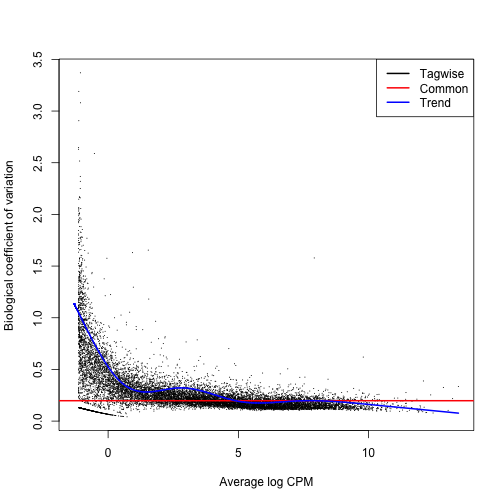
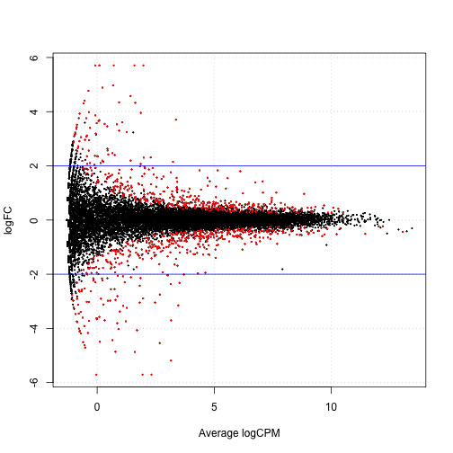
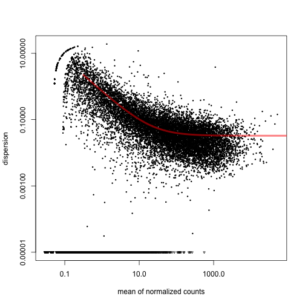
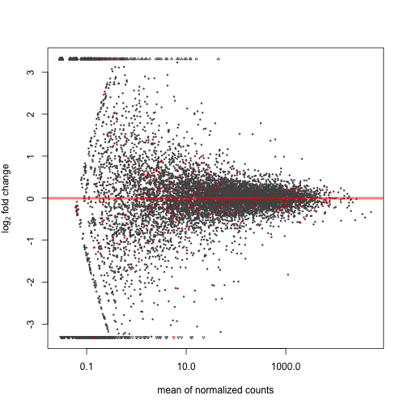
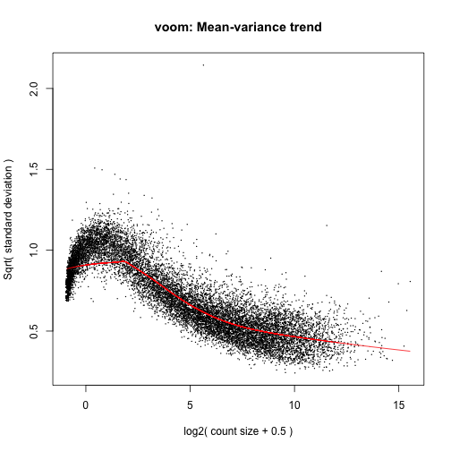

RNA-seq - Differential Expression Analysis
==========================================

> Contributors: Katayoon Kasaian

## Introduction

> In this seminar we will use a table of read counts for genomic features, such as genes or exons, derived from RNA-seq alignment BAM file to perform differential expression analysis. We will use edgeR, DESeq and voom + limma packages for this purpose. We will use the data from this [publication](http://www.ncbi.nlm.nih.gov/pubmed?term=21455293). The mRNA from 21 mice belonging to two different strains have been sequenced; the count table lists the number of reads aligned to the annotated mouse genes in the Ensembl database. Our goal is to identify those genes that are differentially expressed between the two strains.

* [Data file](../examples/bottomly/data/bottomly_count_table.tsv)
* [Design file](../examples/bottomly/data/bottomly_phenodata.tsv)

## Preliminaries

> If you already haven't done so, please install the edgeR package from Bioconductor.


```r
source("http://bioconductor.org/biocLite.R")
biocLite("edgeR")
```


```r
library(edgeR)
```


```r
# You can access the edgeR User's Guide:
edgeRUsersGuide()
```


> or [the reference manual](http://www.bioconductor.org/packages/2.11/bioc/manuals/edgeR/man/edgeR.pdf).

## edgeR

> edgeR implements statistical methods based on the negative binomial distribution for count data. The first version of edgeR implemented exact statistical methods for comparison of multiple groups but is only applicable to experiments with one factor. This sometimes is referred to as classic edgeR. An addition to the classic version is an implementation of generalized linear models (glms) used for analysis of multifactor experiments where the response variables might not follow normal distribution. This sometimes is referred to as glm edgeR. Similar to limma, both versions of edgeR use empirical Bayes methods to estimate gene-specific variation. The classic edgeR uses quantile-adjusted conditional maximum likelihood (qCML) to estimate the disperison while the glm edgeR uses Cox-Reid profile-adjusted likelihood (CR) for dispersion estimation.

> edgeR takes in as an argument a table of integer counts, with rows corresponding to genes and columns to samples.

> Remember you may need to edit the file paths below, to reflect your working directory and local file storage choices.


```r
dat <- read.table("../../../stat540/stat540_2014/examples/bottomly/data/bottomly_count_table.tsv", 
    header = TRUE, row.names = 1)
des <- read.table("../../../stat540/stat540_2014/examples/bottomly/data/bottomly_phenodata.tsv", 
    header = TRUE, row.names = 1)
str(dat)
```

```
## 'data.frame':	36536 obs. of  21 variables:
##  $ SRX033480: int  369 0 0 0 0 0 21 15 517 0 ...
##  $ SRX033488: int  744 0 1 0 1 1 46 43 874 0 ...
##  $ SRX033481: int  287 0 0 0 1 0 20 12 340 0 ...
##  $ SRX033489: int  769 0 1 0 5 1 36 34 813 0 ...
##  $ SRX033482: int  348 0 1 0 0 0 12 14 378 0 ...
##  $ SRX033490: int  803 0 1 0 4 0 55 32 860 0 ...
##  $ SRX033483: int  433 0 0 0 0 0 27 19 528 0 ...
##  $ SRX033476: int  469 0 7 0 0 0 44 18 401 0 ...
##  $ SRX033478: int  585 0 6 0 0 0 32 44 584 0 ...
##  $ SRX033479: int  321 0 1 0 0 0 47 22 401 0 ...
##  $ SRX033472: int  301 0 1 0 4 0 40 17 331 0 ...
##  $ SRX033473: int  461 0 1 0 1 0 40 24 431 0 ...
##  $ SRX033474: int  309 0 1 0 1 0 30 29 341 0 ...
##  $ SRX033475: int  374 0 1 0 0 0 27 15 480 0 ...
##  $ SRX033491: int  781 0 1 0 1 0 46 34 930 0 ...
##  $ SRX033484: int  555 0 2 0 2 0 28 23 585 0 ...
##  $ SRX033492: int  820 0 1 0 1 0 40 38 1137 0 ...
##  $ SRX033485: int  294 0 1 0 1 0 21 17 490 0 ...
##  $ SRX033493: int  758 0 4 0 1 0 52 29 1079 0 ...
##  $ SRX033486: int  419 0 1 0 1 0 27 12 565 0 ...
##  $ SRX033494: int  857 0 5 0 2 0 45 28 726 0 ...
```

```r
show(des)
```

```
##           num.tech.reps   strain experiment.number lane.number
## SRX033480             1 C57BL/6J                 6           1
## SRX033488             1 C57BL/6J                 7           1
## SRX033481             1 C57BL/6J                 6           2
## SRX033489             1 C57BL/6J                 7           2
## SRX033482             1 C57BL/6J                 6           3
## SRX033490             1 C57BL/6J                 7           3
## SRX033483             1 C57BL/6J                 6           5
## SRX033476             1 C57BL/6J                 4           6
## SRX033478             1 C57BL/6J                 4           7
## SRX033479             1 C57BL/6J                 4           8
## SRX033472             1   DBA/2J                 4           1
## SRX033473             1   DBA/2J                 4           2
## SRX033474             1   DBA/2J                 4           3
## SRX033475             1   DBA/2J                 4           5
## SRX033491             1   DBA/2J                 7           5
## SRX033484             1   DBA/2J                 6           6
## SRX033492             1   DBA/2J                 7           6
## SRX033485             1   DBA/2J                 6           7
## SRX033493             1   DBA/2J                 7           7
## SRX033486             1   DBA/2J                 6           8
## SRX033494             1   DBA/2J                 7           8
```

```r
all(rownames(des) == colnames(dat))
```

```
## [1] TRUE
```


### GLM edgeR

> GLM approach allows for comparison of multiple groups and/or factor levels. A design matrix can be created in the same way done for limma. Similarly, contrasts matrices can be used to make comparisons. Most of the glm functions have similar names to the classic version with an addition of 'glm'.

> The first step is to create a 'group' object describing which group each sample belongs to:


```r
with(des, table(strain))
```

```
## strain
## C57BL/6J   DBA/2J 
##       10       11
```

```r
group <- factor(c(rep("1", 10), rep("2", 11)))
group
```

```
##  [1] 1 1 1 1 1 1 1 1 1 1 2 2 2 2 2 2 2 2 2 2 2
## Levels: 1 2
```

```r
# this produces an object of type DGEList with can be manipulated in a
# similar way to any other list object in R
dge.glm <- DGEList(counts = dat, group = group)
str(dge.glm)
```

```
## Formal class 'DGEList' [package "edgeR"] with 1 slots
##   ..@ .Data:List of 2
##   .. ..$ : int [1:36536, 1:21] 369 0 0 0 0 0 21 15 517 0 ...
##   .. .. ..- attr(*, "dimnames")=List of 2
##   .. .. .. ..$ : chr [1:36536] "ENSMUSG00000000001" "ENSMUSG00000000003" "ENSMUSG00000000028" "ENSMUSG00000000031" ...
##   .. .. .. ..$ : chr [1:21] "SRX033480" "SRX033488" "SRX033481" "SRX033489" ...
##   .. ..$ :'data.frame':	21 obs. of  3 variables:
##   .. .. ..$ group       : Factor w/ 2 levels "1","2": 1 1 1 1 1 1 1 1 1 1 ...
##   .. .. ..$ lib.size    : num [1:21] 3040296 6303665 2717092 6545795 3016179 ...
##   .. .. ..$ norm.factors: num [1:21] 1 1 1 1 1 1 1 1 1 1 ...
```

```r
names(dge.glm)
```

```
## [1] "counts"  "samples"
```

```r
dge.glm[["samples"]]
```

```
##           group lib.size norm.factors
## SRX033480     1  3040296            1
## SRX033488     1  6303665            1
## SRX033481     1  2717092            1
## SRX033489     1  6545795            1
## SRX033482     1  3016179            1
## SRX033490     1  7097379            1
## SRX033483     1  3707895            1
## SRX033476     1  5165144            1
## SRX033478     1  4953201            1
## SRX033479     1  4192872            1
## SRX033472     2  3970729            1
## SRX033473     2  4733003            1
## SRX033474     2  3702051            1
## SRX033475     2  3569483            1
## SRX033491     2  7276198            1
## SRX033484     2  4422272            1
## SRX033492     2  7115851            1
## SRX033485     2  3467730            1
## SRX033493     2  7339817            1
## SRX033486     2  3879114            1
## SRX033494     2  6771680            1
```

```r
nrow(dge.glm[[1]])
```

```
## [1] 36536
```

```r
ncol(dge.glm[[1]])
```

```
## [1] 21
```


> This DGELIst object has two components, one is a matrix call 'counts' storing the count data and the other is a data.frame called 'samples' storing information for samples. Optionally, you can also provide an annotation file for the genes which will be stored in the data.frame 'genes'. The data.frame 'samples', contains the samples IDs, group information and library sizes (or equally library sequence depth). You can either supply the library size info or it can be calculated from the sums of counts in each column.


```r
design <- model.matrix(~group)
design
```

```
##    (Intercept) group2
## 1            1      0
## 2            1      0
## 3            1      0
## 4            1      0
## 5            1      0
## 6            1      0
## 7            1      0
## 8            1      0
## 9            1      0
## 10           1      0
## 11           1      1
## 12           1      1
## 13           1      1
## 14           1      1
## 15           1      1
## 16           1      1
## 17           1      1
## 18           1      1
## 19           1      1
## 20           1      1
## 21           1      1
## attr(,"assign")
## [1] 0 1
## attr(,"contrasts")
## attr(,"contrasts")$group
## [1] "contr.treatment"
```

```r
dge.glm.com.disp <- estimateGLMCommonDisp(dge.glm, design, verbose = TRUE)
```

```
## Disp = 0.03893 , BCV = 0.1973
```

```r
dge.glm.trend.disp <- estimateGLMTrendedDisp(dge.glm.com.disp)
```

```
## Loading required package: splines
```

```r
dge.glm.tag.disp <- estimateGLMTagwiseDisp(dge.glm.trend.disp, design)
# plot the tagwise dispersion against log2-CPM (counts per million)
plotBCV(dge.glm.tag.disp)
```

 


```r
fit <- glmFit(dge.glm.tag.disp, design)
colnames(coef(fit))
```

```
## [1] "(Intercept)" "group2"
```

```r
lrt <- glmLRT(fit, coef = 2)
topTags(lrt)
```

```
## Coefficient:  group2 
##                     logFC logCPM    LR    PValue       FDR
## ENSMUSG00000020912 -5.187  3.155 403.2 1.105e-89 4.037e-85
## ENSMUSG00000050141 -5.363  2.319 311.6 9.670e-70 1.767e-65
## ENSMUSG00000035775 -4.543  2.674 298.7 6.232e-67 7.589e-63
## ENSMUSG00000015484 -1.968  4.307 281.8 3.049e-63 2.785e-59
## ENSMUSG00000024248 -3.152  3.463 277.6 2.489e-62 1.819e-58
## ENSMUSG00000030532  1.547  5.572 268.9 1.961e-60 1.194e-56
## ENSMUSG00000054354 -6.283  1.940 248.7 4.924e-56 2.570e-52
## ENSMUSG00000023236  1.426  7.067 244.9 3.292e-55 1.503e-51
## ENSMUSG00000050824  3.705  3.365 230.0 6.054e-52 2.458e-48
## ENSMUSG00000015852 -2.362  3.138 214.8 1.212e-48 4.051e-45
```

```r
tt.glm <- topTags(lrt, n = Inf)
class(tt.glm)
```

```
## [1] "TopTags"
## attr(,"package")
## [1] "edgeR"
```

```r
nrow(tt.glm$table[tt.glm$table$FDR < 0.01, ])
```

```
## [1] 600
```

```r
interestingSamples <- rownames(tt.glm$table[tt.glm$table$FDR < 1e-50, ])
cpm(dge.glm.tag.disp)[interestingSamples, ]
```

```
##                    SRX033480 SRX033488 SRX033481 SRX033489 SRX033482
## ENSMUSG00000020912     20.39    12.691     15.83    14.819    19.230
## ENSMUSG00000050141     14.14    10.153     10.67     6.264     9.946
## ENSMUSG00000035775     14.47    10.629     19.51    11.305    12.930
## ENSMUSG00000015484     26.97    33.949     32.76    36.206    31.497
## ENSMUSG00000024248     14.80    26.017     17.30    23.527    18.567
## ENSMUSG00000030532     27.96    24.906     21.35    25.360    18.567
## ENSMUSG00000054354     10.85     7.615     11.41     8.708     8.289
## ENSMUSG00000023236     65.45    78.684     72.50    72.413    76.587
##                    SRX033490 SRX033483 SRX033476 SRX033478 SRX033479
## ENSMUSG00000020912    17.330    26.430    13.359    23.621    14.310
## ENSMUSG00000050141     7.890     8.361     6.583    11.911    12.402
## ENSMUSG00000035775    12.540    12.136     6.389    13.527    11.210
## ENSMUSG00000015484    33.393    30.745    34.655    26.851    31.482
## ENSMUSG00000024248    25.784    18.879    24.781    14.334    14.310
## ENSMUSG00000030532    26.770    26.430    19.167    23.217    20.034
## ENSMUSG00000054354     7.608     7.012     3.291     4.442     5.963
## ENSMUSG00000023236    80.875    83.336    55.178    57.740    66.303
##                    SRX033472 SRX033473 SRX033474 SRX033475 SRX033491
## ENSMUSG00000020912    0.5037    0.4226    1.0805    0.2802    1.0995
## ENSMUSG00000050141    0.2518    0.0000    0.0000    0.2802    0.8246
## ENSMUSG00000035775    0.7555    0.0000    0.2701    0.2802    0.6872
## ENSMUSG00000015484    7.0516    4.8595    9.1841    7.8443    8.5209
## ENSMUSG00000024248    2.2666    1.2677    1.8908    3.3618    3.1610
## ENSMUSG00000030532   69.7605   70.5683   63.2082   63.0343   73.8023
## ENSMUSG00000054354    0.0000    0.0000    0.0000    0.0000    0.5497
## ENSMUSG00000023236  195.4301  183.6044  176.1186  156.3252  206.9762
##                    SRX033484 SRX033492 SRX033485 SRX033493 SRX033486
## ENSMUSG00000020912    0.0000    0.7027    0.8651    0.1362    0.0000
## ENSMUSG00000050141    0.0000    0.1405    0.0000    0.1362    0.2578
## ENSMUSG00000035775    0.6784    0.1405    0.5767    0.1362    1.8045
## ENSMUSG00000015484    9.4974    8.4319    8.9396    6.6759   10.3116
## ENSMUSG00000024248    1.5829    1.6864    1.7302    1.7712    2.5779
## ENSMUSG00000030532   70.0997   70.6873   62.5770   78.6123   59.2919
## ENSMUSG00000054354    0.0000    0.0000    0.0000    0.0000    0.0000
## ENSMUSG00000023236  177.9628  192.8090  207.0519  201.6399  204.6859
##                    SRX033494
## ENSMUSG00000020912    0.0000
## ENSMUSG00000050141    0.1477
## ENSMUSG00000035775    0.5907
## ENSMUSG00000015484    8.8604
## ENSMUSG00000024248    3.1012
## ENSMUSG00000030532   71.3265
## ENSMUSG00000054354    0.0000
## ENSMUSG00000023236  192.7144
```

```r

summary(de.glm <- decideTestsDGE(lrt, p = 0.05, adjust = "BH"))
```

```
##    [,1] 
## -1   451
## 0  35660
## 1    425
```


451 genes are under-expressed in group 2 (DBA/2J) compared with group 1 (C57BL/6J), 35660 show no differences in expression while 425 genes are over-expressed.


```r
# plotting the tagwise log fold changes against log-cpm
tags.glm <- rownames(dge.glm.tag.disp)[as.logical(de.glm)]
plotSmear(lrt, de.tags = tags.glm)
abline(h = c(-2, 2), col = "blue")
```

 


#### Mini exercise:

> Redo the above analysis but first filter the data and remove any gene that has:
> 1. count equal tot zero across all samples
> 2. count equal to zero in at least one sample in each genotype group

**TODO** - Mini exercise!

## DESeq

> We will try the differential expression analysis of the same dataset using DESeq.


```r
source("http://www.bioconductor.org/biocLite.R")
biocLite("DESeq")
```


```r
library(DESeq)
# reading in the same count table data and grouping information
deSeqDat <- newCountDataSet(dat, group)
head(counts(deSeqDat))
```

```
##                    SRX033480 SRX033488 SRX033481 SRX033489 SRX033482
## ENSMUSG00000000001       369       744       287       769       348
## ENSMUSG00000000003         0         0         0         0         0
## ENSMUSG00000000028         0         1         0         1         1
## ENSMUSG00000000031         0         0         0         0         0
## ENSMUSG00000000037         0         1         1         5         0
## ENSMUSG00000000049         0         1         0         1         0
##                    SRX033490 SRX033483 SRX033476 SRX033478 SRX033479
## ENSMUSG00000000001       803       433       469       585       321
## ENSMUSG00000000003         0         0         0         0         0
## ENSMUSG00000000028         1         0         7         6         1
## ENSMUSG00000000031         0         0         0         0         0
## ENSMUSG00000000037         4         0         0         0         0
## ENSMUSG00000000049         0         0         0         0         0
##                    SRX033472 SRX033473 SRX033474 SRX033475 SRX033491
## ENSMUSG00000000001       301       461       309       374       781
## ENSMUSG00000000003         0         0         0         0         0
## ENSMUSG00000000028         1         1         1         1         1
## ENSMUSG00000000031         0         0         0         0         0
## ENSMUSG00000000037         4         1         1         0         1
## ENSMUSG00000000049         0         0         0         0         0
##                    SRX033484 SRX033492 SRX033485 SRX033493 SRX033486
## ENSMUSG00000000001       555       820       294       758       419
## ENSMUSG00000000003         0         0         0         0         0
## ENSMUSG00000000028         2         1         1         4         1
## ENSMUSG00000000031         0         0         0         0         0
## ENSMUSG00000000037         2         1         1         1         1
## ENSMUSG00000000049         0         0         0         0         0
##                    SRX033494
## ENSMUSG00000000001       857
## ENSMUSG00000000003         0
## ENSMUSG00000000028         5
## ENSMUSG00000000031         0
## ENSMUSG00000000037         2
## ENSMUSG00000000049         0
```


> Next, we estimate the size factors to account for differences in library coverage and estimate the variance:


```r
deSeqDat <- estimateSizeFactors(deSeqDat)
sizeFactors(deSeqDat)
```

```
## SRX033480 SRX033488 SRX033481 SRX033489 SRX033482 SRX033490 SRX033483 
##    0.6439    1.3454    0.5785    1.4295    0.6355    1.5240    0.7933 
## SRX033476 SRX033478 SRX033479 SRX033472 SRX033473 SRX033474 SRX033475 
##    1.1272    1.0772    0.8984    0.8886    1.0255    0.7987    0.7796 
## SRX033491 SRX033484 SRX033492 SRX033485 SRX033493 SRX033486 SRX033494 
##    1.6162    0.9882    1.5720    0.7558    1.5922    0.8264    1.4715
```

```r
deSeqDat <- estimateDispersions(deSeqDat)
# plotting the estimated dispersions against the mean normalized counts
plotDispEsts(deSeqDat)
```

 


> Next, we will fit the model and examine the results


```r
## this takes a minute or so for JB
results <- nbinomTest(deSeqDat, levels(group)[1], levels(group)[2])
str(results)
```

```
## 'data.frame':	36536 obs. of  8 variables:
##  $ id            : chr  "ENSMUSG00000000001" "ENSMUSG00000000003" "ENSMUSG00000000028" "ENSMUSG00000000031" ...
##  $ baseMean      : num  489.18 0 1.57 0 1.1 ...
##  $ baseMeanA     : num  509.685 0 1.657 0 0.859 ...
##  $ baseMeanB     : num  470.53 0 1.49 0 1.32 ...
##  $ foldChange    : num  0.923 NaN 0.898 NaN 1.537 ...
##  $ log2FoldChange: num  -0.115 NaN -0.156 NaN 0.62 ...
##  $ pval          : num  0.498 NA 0.829 NA 0.968 ...
##  $ padj          : num  1 NA 1 NA 1 ...
```

```r
plotMA(results)
```

 


## Voom & limma


```r
library(limma)
norm.factor <- calcNormFactors(dat)
dat.voomed <- voom(dat, design, plot = TRUE, lib.size = colSums(dat) * norm.factor)
```

 

```r
dat.voomed
```

```
## An object of class "EList"
## $E
##                    SRX033480 SRX033488 SRX033481 SRX033489 SRX033482
## ENSMUSG00000000001     6.941     6.916     6.720     6.871     6.860
## ENSMUSG00000000003    -2.588    -3.625    -2.447    -3.716    -2.585
## ENSMUSG00000000028    -2.588    -2.040    -2.447    -2.132    -1.000
## ENSMUSG00000000031    -2.588    -3.625    -2.447    -3.716    -2.585
## ENSMUSG00000000037    -2.588    -2.040    -0.862    -0.257    -2.585
##                    SRX033490 SRX033483 SRX033476 SRX033478 SRX033479
## ENSMUSG00000000001    6.8447      6.87    6.4977    6.8899     6.279
## ENSMUSG00000000003   -3.8055     -2.89   -3.3773   -3.3036    -3.049
## ENSMUSG00000000028   -2.2205     -2.89    0.5296    0.3968    -1.465
## ENSMUSG00000000031   -3.8055     -2.89   -3.3773   -3.3036    -3.049
## ENSMUSG00000000037   -0.6355     -2.89   -3.3773   -3.3036    -3.049
##                    SRX033472 SRX033473 SRX033474 SRX033475 SRX033491
## ENSMUSG00000000001    6.2110     6.615     6.397     6.693     6.737
## ENSMUSG00000000003   -3.0250    -3.236    -2.877    -2.855    -3.873
## ENSMUSG00000000028   -1.4400    -1.651    -1.292    -1.270    -2.288
## ENSMUSG00000000031   -3.0250    -3.236    -2.877    -2.855    -3.873
## ENSMUSG00000000037    0.1449    -1.651    -1.292    -2.855    -2.288
##                    SRX033484 SRX033492 SRX033485 SRX033493 SRX033486
## ENSMUSG00000000001    6.9151     6.855     6.375     6.718     6.760
## ENSMUSG00000000003   -3.2025    -3.825    -2.827    -3.849    -2.952
## ENSMUSG00000000028   -0.8806    -2.240    -1.242    -0.679    -1.367
## ENSMUSG00000000031   -3.2025    -3.825    -2.827    -3.849    -2.952
## ENSMUSG00000000037   -0.8806    -2.240    -1.242    -2.264    -1.367
##                    SRX033494
## ENSMUSG00000000001     7.005
## ENSMUSG00000000003    -3.739
## ENSMUSG00000000028    -0.280
## ENSMUSG00000000031    -3.739
## ENSMUSG00000000037    -1.417
## 36531 more rows ...
## 
## $weights
##        [,1]   [,2]   [,3]   [,4]   [,5]   [,6]   [,7]   [,8]   [,9]  [,10]
## [1,] 15.907 19.293 15.443 19.597 15.899 19.891 16.895 18.482 18.240 17.413
## [2,]  1.632  1.547  1.632  1.531  1.632  1.517  1.632  1.595  1.612  1.632
## [3,]  1.469  1.383  1.488  1.378  1.470  1.374  1.436  1.397  1.402  1.421
## [4,]  1.632  1.547  1.632  1.531  1.632  1.517  1.632  1.595  1.612  1.632
## [5,]  1.558  1.421  1.585  1.414  1.558  1.407  1.507  1.445  1.453  1.484
##       [,11]  [,12]  [,13]  [,14]  [,15]  [,16]  [,17]  [,18]  [,19]  [,20]
## [1,] 16.988 17.670 16.503 16.432 19.760 17.564 19.603 16.339 19.682 16.748
## [2,]  1.632  1.632  1.632  1.632  1.531  1.632  1.539  1.632  1.535  1.632
## [3,]  1.403  1.390  1.415  1.416  1.354  1.392  1.358  1.419  1.356  1.409
## [4,]  1.632  1.632  1.632  1.632  1.531  1.632  1.539  1.632  1.535  1.632
## [5,]  1.423  1.406  1.437  1.439  1.370  1.409  1.373  1.442  1.371  1.429
##       [,21]
## [1,] 19.318
## [2,]  1.555
## [3,]  1.364
## [4,]  1.555
## [5,]  1.377
## 36531 more rows ...
## 
## $design
##   (Intercept) group2
## 1           1      0
## 2           1      0
## 3           1      0
## 4           1      0
## 5           1      0
## 16 more rows ...
## 
## $targets
## [1] 3006197 6166939 2726341 6572633 3000692
## 16 more rows ...
```

```r
fit <- lmFit(dat.voomed, design)
fit <- eBayes(fit)
topTable(fit)
```

```
##                    X.Intercept.    group2 AveExpr      F   P.Value
## ENSMUSG00000025867       12.477 -0.013979  12.471 154234 2.584e-55
## ENSMUSG00000022892       12.268 -0.086479  12.223 138459 1.103e-54
## ENSMUSG00000037852       12.321 -0.237470  12.194 134826 1.576e-54
## ENSMUSG00000042700       10.716 -0.048029  10.692 133973 1.717e-54
## ENSMUSG00000029461       10.300  0.020715  10.311 121795 6.182e-54
## ENSMUSG00000020658        9.610 -0.019628   9.601 119935 7.604e-54
## ENSMUSG00000060261        9.469 -0.015743   9.461 117841 9.635e-54
## ENSMUSG00000032549       11.904  0.003545  11.905 117324 1.022e-53
## ENSMUSG00000024462       10.227 -0.138929  10.153 116767 1.090e-53
## ENSMUSG00000030102       12.085 -0.026149  12.073 112155 1.874e-53
##                    adj.P.Val
## ENSMUSG00000025867 9.442e-51
## ENSMUSG00000022892 1.568e-50
## ENSMUSG00000037852 1.568e-50
## ENSMUSG00000042700 1.568e-50
## ENSMUSG00000029461 4.424e-50
## ENSMUSG00000020658 4.424e-50
## ENSMUSG00000060261 4.424e-50
## ENSMUSG00000032549 4.424e-50
## ENSMUSG00000024462 4.424e-50
## ENSMUSG00000030102 6.417e-50
```

```r
# The rest you know.....
```


## Take Home Problem

> Choose a specific threshold for the adjusted p value, find the genes identified as differentially expressed using each of edgeR, DESeq and voom+limma. Compare the number of genes in these 3 lists, and draw a venn digram demonstrating the overlap (if any!).

**TODO - Take-home problem!**
