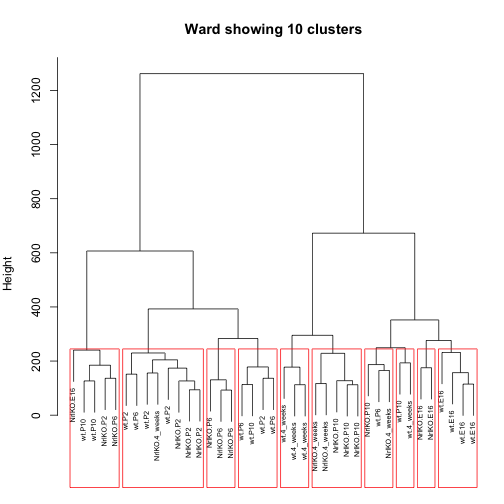
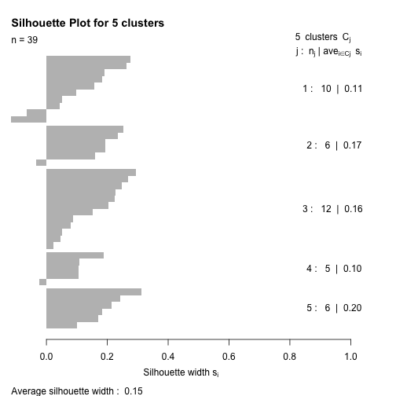
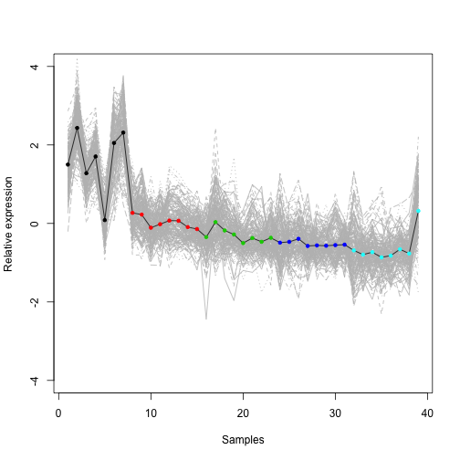
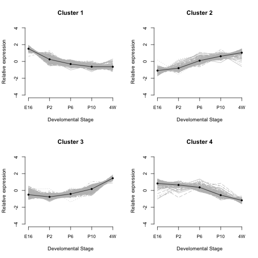
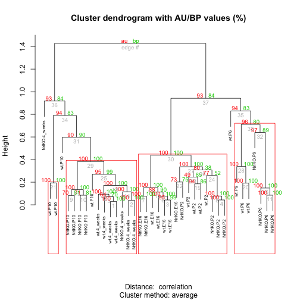
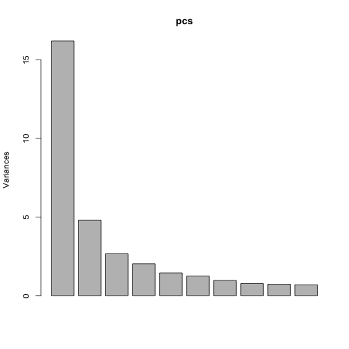
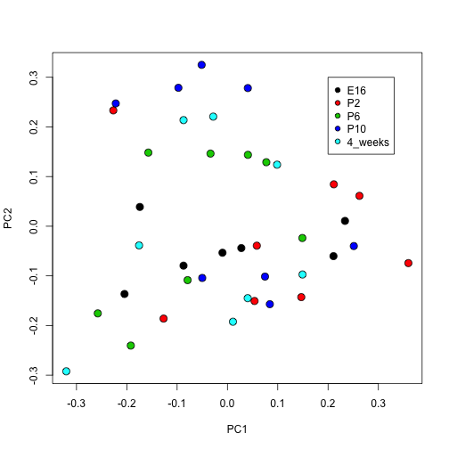

Seminar 9: Cluster Analysis and PCA
===================================


> Contributor: Gabriela Cohen Freue

## Introduction

> In this seminar we'll explore clustering genes and samples using the photoreceptor time series with the two genotypes. It is interesting to compare the results of different clustering algorithms, and to see the effect of filtering and/or definitions of attributes on the resulting clusters.  

## Load data and packages

> Load the `photoRec` data. Remember, for more information on the `photoRec` dataset, go [here](https://github.com/jennybc/stat540_2014/tree/master/examples/photoRec). 

> Install required packages if you haven't done so before. This seminar will require `pvclust`, `xtable`, `limma`, `cluster`, `RColorBrewer`, and `plyr`.

> Remember you may need to edit the file paths below, to reflect your working directory and local file storage choices.


```r
library(RColorBrewer)
library(cluster)
library(pvclust)
library(xtable)
library(limma)
library(plyr)
library(lattice)
```


```r
prDat <- read.table("../../stat540_2014/examples/photoRec/data/GSE4051_data.tsv",
                    header = TRUE, row.names = 1) # the whole enchilada
str(prDat, max.level = 0)
```

```
## 'data.frame':	29949 obs. of  39 variables:
```

```r
prDes <- readRDS("../../stat540_2014/examples/photoRec/data/GSE4051_design.rds")
str(prDes)
```

```
## 'data.frame':	39 obs. of  4 variables:
##  $ sidChar : chr  "Sample_20" "Sample_21" "Sample_22" "Sample_23" ...
##  $ sidNum  : num  20 21 22 23 16 17 6 24 25 26 ...
##  $ devStage: Factor w/ 5 levels "E16","P2","P6",..: 1 1 1 1 1 1 1 2 2 2 ...
##  $ gType   : Factor w/ 2 levels "wt","NrlKO": 1 1 1 1 2 2 2 1 1 1 ...
```


> Finally, as an additional step to make visualization easier later, we'll rescale the rows, since we're not interested in absolute differences in expression between genes at the moment. Note that although one can do this step within the `heatmap()` function, it will not be available for other functions we will use. We can always go back to the original data if we need to.


```r
sprDat <- t(scale(t(prDat)))
str(sprDat, max.level = 0, give.attr = FALSE)
```

```
##  num [1:29949, 1:39] 0.0838 0.1758 0.7797 -0.3196 0.8358 ...
```

```r
round(data.frame(avgBefore = rowMeans(head(prDat)),
                 avgAfter = rowMeans(head(sprDat)),
                 varBefore = apply(head(prDat), 1, var),
                 varAfter = apply(head(sprDat), 1, var)), 2)
```

```
##              avgBefore avgAfter varBefore varAfter
## 1415670_at        7.22        0      0.02        1
## 1415671_at        9.37        0      0.35        1
## 1415672_at        9.70        0      0.15        1
## 1415673_at        8.42        0      0.03        1
## 1415674_a_at      8.47        0      0.02        1
## 1415675_at        9.67        0      0.03        1
```


> The data for each row -- which is for one probeset -- now has mean 0 and variance 1.
        
## Sample Clustering

> In this part, we will use samples as objects to be clustered using gene attributes (i.e., vector variables of dimension ~30K). 

### Hierarchical clustering for `photoRec` data

> In this section we will illustrate different hierarchical clustering methods. These plots were included in Lecture 16.

> However, for most expression data applications, we suggest you should standardize the data; use Euclidean as the "distance" (so it's just like Pearson correlation) and use "average linkage". 


```r
# compute pairwise distances
pr.dis <- dist(t(sprDat), method = 'euclidean')

# create a new factor representing the interaction of gType and devStage
prDes$grp <- with(prDes, interaction(gType, devStage))
summary(prDes$grp)
```

```
##        wt.E16     NrlKO.E16         wt.P2      NrlKO.P2         wt.P6 
##             4             3             4             4             4 
##      NrlKO.P6        wt.P10     NrlKO.P10    wt.4_weeks NrlKO.4_weeks 
##             4             4             4             4             4
```

```r

# compute hierarchical clustering using different linkage types
pr.hc.s <- hclust(pr.dis, method = 'single')
pr.hc.c <- hclust(pr.dis, method = 'complete')
pr.hc.a <- hclust(pr.dis, method = 'average')
pr.hc.w <- hclust(pr.dis, method = 'ward')

# plot them
op <- par(mar = c(0,4,4,2), mfrow = c(2,2))
plot(pr.hc.s, labels = FALSE, main = "Single", xlab = "")
plot(pr.hc.c, labels = FALSE, main = "Complete", xlab = "")
plot(pr.hc.a, labels = FALSE, main = "Average", xlab = "")
plot(pr.hc.w, labels = FALSE, main = "Ward", xlab = "")
```

 

```r

par(op)

# identify 10 clusters
op <- par(mar = c(1,4,4,1))
plot(pr.hc.w, labels = prDes$grp, cex = 0.6, 
     main = "Ward showing 10 clusters")
rect.hclust(pr.hc.w, k = 10)
```

 

```r
par(op)
```


> When you call `heatmap()`, it automatically performs hierarchical clustering for you and it reorders the rows and/or columns of the data accordingly. Both the reordering and the dendrograms can be suppressed it with `Rowv = NA` and/or `Colv = NA`. 

> Note that when you have a lot of genes, the tree is pretty ugly. Thus, the row clustering was suppressed for now.

> By default, `heatmap()` uses the `hclust()` function, which takes a distance matrix, calculated by the `dist()` function (with `default = 'euclidean'`). However, you can also write your own clustering and distance functions. In the examples below, I used `hclust()` with `ward` linkage method and the `euclidean` distance. 

> Note that the dendrogram in the top margin of the heatmap is the same as that of the `hclust()` function.

> __Exercise__: Play with the options of the heatmap function and compare the different heatmaps. Note that one can also use the original data `prDat` and set the option `scale = "row"`. You will get the same heatmaps although the columns may be ordered differently (use `Colv = NA` to suppress reordering).


```r
jGraysFun <- colorRampPalette(brewer.pal(n = 9, "Greys"))
gTypeCols <- brewer.pal(11, "RdGy")[c(4,7)]
heatmap(as.matrix(sprDat), Rowv = NA, col = jGraysFun(256),
        hclustfun = function(x) hclust(x, method = 'ward'),
        scale = "none", labCol = prDes$grp, labRow = NA, margins = c(8,1),
        ColSideColor = gTypeCols[unclass(prDes$gType)])
legend("topright", legend = levels(prDes$gType),
       col = gTypeCols, lty = 1, lwd = 5, cex = 0.5)
```

 


### Partitioning methods for `photoRec` data

> Note that the results depend on the initial values (randomly generated) to create the first k clusters. In order to get the same results, you need to set many initial points (see the parameter `nstart`).

#### K-means clustering

> K-means is a classic clustering method described in Lecture 16. An important observation about k-means is that it cannot determine the number of clusters for you. In fact, doing this automatically is quite hard (though techniques do exist).

> Here we'll just do a clustering of samples using all genes (~30K).


```r
#Objects in columns

set.seed(31)
k <- 5
pr.km <- kmeans(t(sprDat), centers = k, nstart =  50)

#We can look at the within sum of squares of each cluster
pr.km$withinss
```

```
## [1] 120153  78227 110209 100197 133036
```

```r

#We can look at the composition of each cluster

pr.kmTable <- data.frame(devStage = prDes$devStage, cluster = pr.km$cluster)
prTable  <-  xtable(with(pr.kmTable, table(devStage,cluster)),
                    caption='Number of samples from each develomental stage within each k-means cluster')
```


```r
align(prTable) <- "lccccc"
print(prTable, type = 'html', caption.placement = 'top')
```

<!-- html table generated in R 3.0.2 by xtable 1.7-3 package -->
<!-- Tue Mar 25 21:34:04 2014 -->
<TABLE border=1>
<CAPTION ALIGN="top"> Number of samples from each develomental stage within each k-means cluster </CAPTION>
<TR> <TH>  </TH> <TH> 1 </TH> <TH> 2 </TH> <TH> 3 </TH> <TH> 4 </TH> <TH> 5 </TH>  </TR>
  <TR> <TD> E16 </TD> <TD align="center">   0 </TD> <TD align="center">   0 </TD> <TD align="center">   6 </TD> <TD align="center">   0 </TD> <TD align="center">   1 </TD> </TR>
  <TR> <TD> P2 </TD> <TD align="center">   4 </TD> <TD align="center">   0 </TD> <TD align="center">   0 </TD> <TD align="center">   0 </TD> <TD align="center">   4 </TD> </TR>
  <TR> <TD> P6 </TD> <TD align="center">   5 </TD> <TD align="center">   1 </TD> <TD align="center">   0 </TD> <TD align="center">   0 </TD> <TD align="center">   2 </TD> </TR>
  <TR> <TD> P10 </TD> <TD align="center">   1 </TD> <TD align="center">   2 </TD> <TD align="center">   0 </TD> <TD align="center">   3 </TD> <TD align="center">   2 </TD> </TR>
  <TR> <TD> 4_weeks </TD> <TD align="center">   0 </TD> <TD align="center">   2 </TD> <TD align="center">   1 </TD> <TD align="center">   5 </TD> <TD align="center">   0 </TD> </TR>
   </TABLE>


> Repeat the analysis using a different seed and check if you get the same clusters.

> Helpful info and tips:

>   * An aside on `set.seed()`: Normally you might not need to set this; R will pick one. But if you are doing a "real" experiment and using methods that require random number generation, you should consider it when finalizing an analysis. The reason is that your results might come out slightly different each time you run it. To ensure that you can exactly reproduce the results later, you should set the seed (and record what you set it to). Of course if your results are highly sensitive to the choice of seed, that indicates a problem. In the case above, we're just choosing genes for an exercise so it doesn't matter, but setting the seed makes sure all students are looking at the same genes. 

#### PAM algorithm

> K representative objects (= medoids) are chosen as cluster centers and objects are assigned to the center (= medoid = cluster) with which they have minimum dissimilarity (Kaufman and Rousseeuw, 1990). Nice features of PAM are: (a) it accepts a dissimilarity matrix (use `diss = TRUE`); (b) it is more robust to outliers as the centroids of the clusters are data objects; (c) one can determine the number of clusters by exploring the average silhouette value.


```r
pr.pam <- pam(pr.dis, k = k)
pr.pamTable <- data.frame(devStage = prDes$devStage,
                          cluster = pr.pam$clustering)
pamTable  <-  xtable(with(pr.pamTable, table(devStage, cluster)),
                     caption='Number of samples from each develomental stage within each PAM cluster')
```


```r
align(pamTable) <- "lccccc"
print(pamTable, type = 'html', caption.placement = 'top')
```

<!-- html table generated in R 3.0.2 by xtable 1.7-3 package -->
<!-- Tue Mar 25 21:34:04 2014 -->
<TABLE border=1>
<CAPTION ALIGN="top"> Number of samples from each develomental stage within each PAM cluster </CAPTION>
<TR> <TH>  </TH> <TH> 1 </TH> <TH> 2 </TH> <TH> 3 </TH> <TH> 4 </TH> <TH> 5 </TH>  </TR>
  <TR> <TD> E16 </TD> <TD align="center">   6 </TD> <TD align="center">   1 </TD> <TD align="center">   0 </TD> <TD align="center">   0 </TD> <TD align="center">   0 </TD> </TR>
  <TR> <TD> P2 </TD> <TD align="center">   0 </TD> <TD align="center">   1 </TD> <TD align="center">   7 </TD> <TD align="center">   0 </TD> <TD align="center">   0 </TD> </TR>
  <TR> <TD> P6 </TD> <TD align="center">   3 </TD> <TD align="center">   2 </TD> <TD align="center">   3 </TD> <TD align="center">   0 </TD> <TD align="center">   0 </TD> </TR>
  <TR> <TD> P10 </TD> <TD align="center">   0 </TD> <TD align="center">   2 </TD> <TD align="center">   1 </TD> <TD align="center">   1 </TD> <TD align="center">   4 </TD> </TR>
  <TR> <TD> 4_weeks </TD> <TD align="center">   1 </TD> <TD align="center">   0 </TD> <TD align="center">   1 </TD> <TD align="center">   4 </TD> <TD align="center">   2 </TD> </TR>
   </TABLE>


> Additional information on the PAM result is available through `summary(pr.pam)`

**The silhouette plot**

> The `cluster` package contains the function `silhouette()` that compares the minimum average dissimilarity of each object to other clusters __with__ the average dissimilarity to objects in its own cluster. The resulting measure is called the "width of each object's silhouette". A value close to 1 indicates that the object is similar to objects in its cluster compared to those in other clusters. Thus, the average of all objects silhouette widths gives an indication of how well the clusters are defined. 


```r
op <- par(mar = c(5,1,4,4))
plot(pr.pam, main = "Silhouette Plot for 5 clusters")
```

 

```r
par(op)
```


> Exercise: draw a plot with number of clusters in the x-axis and the average silhouette widths in the y-axis. Use the information obtained to determine if 5 was the best choice for the number of clusters.

> Exercise: For a common choice of $k$, compare the clustering across different methods, e.g. hierarchical (pruned to specific $k$, obviously), k-means, PAM. You will re-discover the "label switching problem" for yourself. How does that manifest itself? How concordant are the clusterings for different methods?

## Gene clustering

> A different view at the data can be obtained from clustering genes instead of samples. Since clustering genes is slow when you have a lot of genes, for the sake of time we will work with a smaller subset of genes. 

> In many cases, analysts use cluster analysis to illustrate the results of a differential expression analysis. Sample clustering following a differential expression (DE) analysis will probably show the separation of the groups identified by the DE analysis. Thus, as it was mentioned in lectures, we need to be careful in over-interpreting these kind of results. However, note that it is valid to perform a gene clustering to see if differential expressed genes cluster according to their function, subcellular localizations, pathways, etc.

####  A smaller dataset 

> In [Seminar 6: Fitting and interpretting linear models (high volume)](seminar06_highVolumeLinearModelling.html), you've learned how to use `limma` to fit a common linear model to a very large number of genes and thus identify genes that show differential expression over the course of development.  


> We start by using different clustering algorithms to cluster the top 972 genes that showed differential expression across the different developmental stage (BH adjusted p value < 10<sup>-5</sup>).

#### Hierarchical:


```r
geneC.dis <- dist(topDat, method = 'euclidean')
geneC.hc.a <- hclust(geneC.dis, method = 'average')
plot(geneC.hc.a, labels = FALSE,
     main = "Hierarchical with Average Linkage", xlab = "")
```

 


> When there are lots of objects to cluster, the dendrograms are in general not very informative as it is difficult to identify any interesting pattern in the data.

#### Partitioning

> The most interesting thing to look at is the cluster centers (basically the "prototype" for the cluster) and membership sizes. Then we can try to visualize the genes that are in each cluster.

> Let's visualize a cluster (remember the data were rescaled) using line plots. This makes sense since we also want to be able to see the cluster center.


```r
set.seed(1234)
k <- 5
kmeans.genes <- kmeans(topDat, centers = k)

# choose which cluster we want
clusterNum <- 1 

# Set up the axes without plotting; ylim set based on trial run.
plot(kmeans.genes$centers[clusterNum, ], ylim = c(-4, 4), type = 'n',
     xlab = "Samples", ylab = "Relative expression" ) 

# Plot the expression of all the genes in the selected cluster in grey. 
matlines(y = t(topDat[kmeans.genes$cluster == clusterNum, ]), col = 'grey') 

# Add the cluster center. This is last so it isn't underneath the members
points(kmeans.genes$centers[clusterNum, ], type = 'l') 

# Optional: colored points to show which development stage the samples are from.
points(kmeans.genes$centers[clusterNum, ],  col = prDes$devStage, pch = 20) 
```

 


> Improve the plot above adding sample names to the x-axis (e.g., wt_E16_1)

#### Or, probably more commonly used, we can see both dendrograms using heatmaps (through hierarchical clustering): :


```r
devStageCols <- brewer.pal(11, "RdGy")[c(2,4,7,9,11)]
heatmap(as.matrix(topDat), col = jGraysFun(256),
        hclustfun = function(x) hclust(x, method = 'average'),
        labCol = prDes$grp, labRow = NA, margin = c(8,1), scale = "none",
        ColSideColor = devStageCols[unclass(prDes$devStage)])
legend("topleft", levels(prDes$devStage), col = devStageCols,
       lty = 1, lwd = 5, cex = 0.5)
```

 


### Redefining the attributes

> In the previous example, all the samples were used as attributes to cluster genes. However, we can define different attributes, for example, by estimating parameters of a linear model. Consider:

$$
  \begin{equation}
  X_{gi,devStage} = \mu_{g,devStage} + \epsilon_{gi,devStage}
  \end{equation}
$$

> Thus, we can define a new attributes for each gene, i.e., $$Att_g=(\mu_{g,E16},\mu_{g,P2},\mu_{g,P6},\mu_{g,P10},\mu_{g,4w})$$ and estimate these parameters.


```r
annoTopDat <- stack(as.data.frame(topDat)) # stack probe data tall and skinny
annoTopDat$probeset <- rownames(topDat) # add probeset ID as variable
## get info on gType and devStage, then average over reps within devStage
annoTopDat <- merge(annoTopDat, prDes, by.x = "ind", by.y = "sidChar")
devStageAvg <- ddply(annoTopDat, ~ probeset, function(x) {
  avgByDevStage <- aggregate(values ~ devStage, x, mean)$values
  names(avgByDevStage) <- levels(x$devStage)
  avgByDevStage
  })
## put probset info back into rownames
rownames(devStageAvg) <- devStageAvg$probeset
devStageAvg$probeset <- NULL
str(devStageAvg)
```

```
## 'data.frame':	972 obs. of  5 variables:
##  $ E16    : num  -0.628 1.235 -0.419 1.401 0.855 ...
##  $ P2     : num  -1.041 0.7 -0.918 0.737 0.74 ...
##  $ P6     : num  -0.214 -0.26 -0.744 -0.66 0.34 ...
##  $ P10    : num  0.722 -0.683 0.553 -0.779 -0.363 ...
##  $ 4_weeks: num  1.083 -0.838 1.475 -0.523 -1.464 ...
```


```r
heatmap(as.matrix(devStageAvg), Colv = NA, col = jGraysFun(256),
        hclustfun = function(x) hclust(x,method = 'average'),
        labCol = colnames(devStageAvg), labRow = NA, margin = c(8,1))
```

 


> We can look at the average expression of genes within a cluster for each developmental stage.


```r
k <- 4
geneDS.km <- kmeans(devStageAvg, centers = k, nstart = 50)
clust.centers <- geneDS.km$centers

#Look at all clusters
op <- par(mfrow = c(2, 2))
for(clusterNum in 1:4) {
  # Set up the axes without plotting; ylim set based on trial run.
  plot(clust.centers[clusterNum,], ylim = c(-4,4), type='n',
       xlab = "Develomental Stage", ylab = "Relative expression",
       axes = F, main = paste("Cluster", clusterNum, sep = " ")) 
  axis(2)
  axis(1, 1:5, c(colnames(clust.centers)[1:4],"4W"), cex.axis = 0.9)
  
  # Plot the expression of all the genes in the selected cluster in grey.
  matlines(y = t(devStageAvg[geneDS.km$cluster == clusterNum, ]),
           col = 'grey') 
  
  # Add the cluster center. This is last so it isn't underneath the members
  points(clust.centers[clusterNum, ] , type = 'l') 
  
  # Optional: points to show development stages.
  points(clust.centers[clusterNum, ],  pch = 20)
  } 
```

 

```r
par(op)
```


> Or we can compare all clusters' centers.


```r
plot(clust.centers[clusterNum, ], ylim = c(-4, 4), type = 'n',
     xlab = "Develomental Stage", ylab = "Average expression",
     axes = FALSE, main = "Clusters centers") 
axis(2)
axis(1, 1:5, c(colnames(clust.centers)[1:4],"4W"), cex.axis = 0.9)

for(clusterNum in 1:4) {
  points(clust.centers[clusterNum,], type = 'l', col = clusterNum, lwd=2) 
  points(clust.centers[clusterNum,] , col = clusterNum, pch = 20)
  }
```

 


> We can look at 3-dimensions of the data and illustrate clusters determined by kmeans. The most interesting analysis is to follow with a biological interpretation of the clusters. For that, smaller clusters may be easier to interpret.


```r
cloud(devStageAvg[ ,"E16"] ~ devStageAvg[ ,"P6"] *
        devStageAvg[ ,"4_weeks"], col = geneDS.km$clust,
      xlab = "E16", ylab = "P6", zlab = "4_weeks")
```

 


## Statistical measures to evaluate clusters

> An important issue for clustering is the question of certainty of the cluster membership. Clustering always gives you an answer, even if there aren't really any underlying clusters. There are many ways to address this. Here we introduce an approachable one offered in R, `pvclust`, which you can read about at (<http://www.is.titech.ac.jp/~shimo/prog/pvclust/>).

> Important: `pvclust` clusters the columns. I don't recommend doing this for genes! The computation will take a very long time. Even the following example with all 30K genes will take some time to run.

> You control how many bootstrap iterations `pvclust` does with the `nboot` parameter. We've also noted that `pvclust` causes problems on some machines, so if you have trouble with it, it's not critical. 


```r
pvc <- pvclust(topDat, nboot = 100)
```

```
## Bootstrap (r = 0.5)... Done.
## Bootstrap (r = 0.6)... Done.
## Bootstrap (r = 0.7)... Done.
## Bootstrap (r = 0.8)... Done.
## Bootstrap (r = 0.9)... Done.
## Bootstrap (r = 1.0)... Done.
## Bootstrap (r = 1.1)... Done.
## Bootstrap (r = 1.2)... Done.
## Bootstrap (r = 1.3)... Done.
## Bootstrap (r = 1.4)... Done.
```

```r
plot(pvc, labels = prDes$grp, cex = 0.6)
pvrect(pvc, alpha = 0.95) 
```

 


## PCA (principal components analysis)

> In R, we can use `prcomp()` to do PCA. You can also use `svd()`. The following code reproduces some of the material shown in the PCA/SVD lecture. (The genes used are not the same so it won't be exactly equivalent)

> Scaling is suppressed because we already scaled the rows. You can experiment with this to see what happens.


```r
pcs <- prcomp(sprDat, center = F, scale = F) 

# scree plot
plot(pcs) 
```

 

```r

# append the rotations for the first 10 PCs to the phenodata
prinComp <- cbind(prDes, pcs$rotation[prDes$sidNum, 1:10]) 

# scatter plot showing us how the first few PCs relate to covariates
plot(prinComp[ ,c("sidNum", "devStage", "gType", "PC1", "PC2", "PC3")],
     pch = 19, cex = 0.8) 
```

 

```r

# plot data on first two PCs, colored by development stage
plot(prinComp[ ,c("PC1","PC2")], bg = prDes$devStage, pch = 21, cex = 1.5)
legend(list(x = 0.2, y = 0.3), as.character(levels(prDes$devStage)),
       pch = 21, pt.bg = c(1,2,3,4,5))
```

 


> It is commonly seen a cluster analysis on the first 3 principal components to illustrate and explore the data. 

> Most of the plots in this Seminar were done with basic R graphics. As an exercise, you can try to create new plots using `lattice` and/or `ggplot2`!
